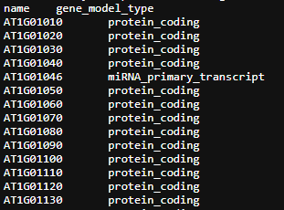

```{r setup, include = FALSE}
# Setup chunk
# Paquetes a usar
#options(htmltools.dir.version = FALSE) cambia la forma de incluir código, los colores

library(knitr)
library(tidyverse)
library(xaringanExtra)
library(icons)
library(fontawesome)
library(emo)

# set default options
opts_chunk$set(collapse = TRUE,
               dpi = 300,
               warning = FALSE,
               error = FALSE,
               comment = "#")

top_icon = function(x) {
  icons::icon_style(
    icons::fontawesome(x),
    position = "fixed", top = 10, right = 10
  )
}

knit_engines$set("yaml", "markdown")

# Con la tecla "O" permite ver todas las diapositivas
xaringanExtra::use_tile_view()
# Agrega el boton de copiar los códigos de los chunks
xaringanExtra::use_clipboard()

# Crea paneles impresionantes 
xaringanExtra::use_panelset()

# Para compartir e incrustar en otro sitio web
xaringanExtra::use_share_again()
xaringanExtra::style_share_again(
  share_buttons = c("twitter", "linkedin")
)

# Funcionalidades de los chunks, pone un triangulito junto a la línea que se señala
xaringanExtra::use_extra_styles(
  hover_code_line = TRUE,         #<<
  mute_unhighlighted_code = TRUE  #<<
)

# Agregar web cam

xaringanExtra::use_webcam()
```

```{r xaringan-editable, echo=FALSE}
# Para tener opciones para hacer editable algun chunk
xaringanExtra::use_editable(expires = 1)
# Para hacer que aparezca el lápiz y goma
xaringanExtra::use_scribble()
```

```{r xaringan-themer, include=FALSE, warning=FALSE}
# Establecer colores para el tema
library(xaringanthemer)
#style_mono_light(base_color = "#562457")
```

class: title-slide, middle, center
background-image: url(imagenes/liigh_unam_logo.png) 
background-position: 10% 10%
background-size: 15% 


.center-column[
# `r rmarkdown::metadata$title`
### `r rmarkdown::metadata$subtitle`

####`r rmarkdown::metadata$author` 
#### `r rmarkdown::metadata$date`
]

---
background-image: url(imagenes/liigh_unam_logo.png) 
background-position: 10% 10%
background-size: 10%
class: middle, center


# VieRnes de Bioinformática
----

.left-col[ 
### `r fontawesome::fa("dna", fill = "#181818")` Sofía Salazar Magaña

Estudiante de la [Licenciatura en Ciencias Genómicas](https://www.enesjuriquilla.unam.mx/?page_id=2136) @ ENES-J UNAM

Asistente de investigación @ [RegGenoLab](https://liigh.unam.mx/), LIIGH UNAM

Asistente de investigación @ [Im Lab](https://hakyimlab.org/), The University of Chicago 


[`r fontawesome::fa("github")` GitHub: SophSM](https://github.com/SophSM)
]

.center-col[
### `r fontawesome::fa("star", fill = "#181818")` Miembro

- [LupusRGMX](https://twitter.com/LupusRgmx)

- [Proyecto JAGUAR](https://twitter.com/PJaguarLATAM)
]

.right-col[


]
---
class: center, middle

`r fontawesome::fa("code", height = "3em")`
# Clase 1. Introducción a R

---

## ¿Qué es R?

R es un entorno de desarrollo de software libre y lenguaje de programación. 

**¿Por qué utilizar R?**

Es ampliamente utilizado para la *computación estadística, gráfica, y de machine learning*. Ofrece una amplia variedad de **funciones estadísticas** (modelos lineales y no lineales, pruebas estadísticas clásicas, análisis de series de tiempo, clasificación, agrupamiento, etc.), y para realizar gráficas.

Además, existen numerosas librerías que nos pemiten realizar análisis y más gráficas, incluyendo para análisis de datos genómicos.

.center[

]

---

.center[

]

---

## ¿Cómo instalamos R?

Para installar R, debemos de entrar a la página de [CRAN](https://cran.r-project.org/) "The Comprehensive R Archive Network". Al installar R, descargamos también ~ 25 paqueterías/librerías.

**CRAN** es una red en la que se archivan todas las versiones de R base, así como todos los paquetes para R que han pasado por un proceso de revisión riguroso, realizado por el CRAN Team.

.center[

]

---

## ¿Qué es RStudio?

RStudio es un **entorno de desarrollo integrado (IDE)** para R. Un IDE es una aplicación que ayuda a los programadores a *desarrollar código de una manera eficiente*. Nos proporciona una interfaz para poder editar código fuente, herramientas de ambiente, visualización, terminal y consola.

**RStudio Desktop** es una aplicación que se utiliza ampliamente para desarrollar programas en R, pero también podemos accesar al IDE de RStudio a través con [RStudio Server](https://posit.co/download/rstudio-server/), a través de un navegador web.

.center[

]
---
## ¿Cómo descargamos RStudio?

Podemos descargar RStudio desde [esta página](https://posit.co/download/rstudio-desktop/). Ya realizamos el paso 1: Install R. 

En el paso 2: Install R studio, nos debería detectar el sistema operativo, descarguemos la versión recomendada en el botón **azul** y sigamos las instrucciones de instalación.
.center[

]
---
## Las partes de RStudio

.center[

]
---
## Cambiando el aspecto de RStudio

Podemos cambiar la forma en que se ve la aplicación desde **Editar > Preferencias > Apariencia**, escogemos el tema que nos guste y damos click en **Aplicar** y luego **OK** 

.center[

]

---

## Comenzando con R y RStudio: 1. R Project

Al comenzar a trabajar con R y RStudio, ya sea para crear un programa para un proyecto, crear una aplicación, presentación, blog, paquete, etc, es recomendado crear un **R project**.

Al crear un R project, se creará un folder en donde estarán todos los documentos, fotos, scripts, etc. que usaremos en ese projecto. Es una forma organizada y práctica de trabajar con R.

---
## ¿Cómo iniciamos un R project?

Vayamos en la parte superior al menú **Archivos > Nuevo Proyecto**.
.center[
]
---
## ¿Cómo iniciamos un R project?

Seleccionamos la opción de **Nuevo directorio**.
.center[
]
---

## ¿Cómo iniciamos un R project?

Seleccionamos el tipo de projecto que vamos a iniciar, en nuestro caso **Nuevo proyecto**.
.center[
]
---

## ¿Cómo iniciamos un R project?

Nombramos el folder que crearemos y seleccionamos en dónde queremos que se almacene. 
.center[
]
---

## ¿Cómo iniciamos un R project?

¡Felicidades, acabas de crear un R project! Si vamos al folder en donde creamos nuestro proyecto, podemos observar que se creó un archivo con terminación **Rproj**, este es un archivo que contiene la configuración específica para nuestro proyecto. 

Este archivo también establece como **directorio de trabajo** el folder en donde iniciamos el proyecto (puedes comprobarlo desde la consola de RStudio, escribiendo el comando `getwd()`). Esto es muy conveniente puesto que así podemos asegurarnos de que vamos a acceder a los archivos que estén exclusivamente en nuestro entorno de trabajo.

```{r}
getwd()
```

Cambiar directorio de trabajo

```{r eval = F}
setwd("/Users/sofiasalazar/nuevodirectorio") # Mac y Linux, iOS, ejemplo de Sofi
setwd("C:/Users/ecoss/OneDrive - CINVESTAV/Documentos/Posdoc_LIIGH/Clases_Cursos_Medicina_Guadalajara2023") # Windows
```

---
## Comenzando con nuestro proyecto: Crear un Rscript

Para comenzar a trabajar en un proyecto, necesitamos crear un archivo para escribir nuestro programa. Entra en **Archivo > Nuevo Archivo**.

Podemos ver que tenemos distintas opciones de archivos que podemos crear, en este caso vamos a crear nuestro primer Rscript.

.center[
]

---
## Crear un Rscript

**¿Qué es un Rscript?** Es simplemente un archivo de texto con las instrucciones de nuestro algoritmo escritas en el lenguaje de R. También contiene nuestros comentarios escritos con `#`.

Intenta escribir tu primer Rscript en el **editor**, copiando el siguiente algoritmo para realizar una suma:

```{r, eval = F}
a <- 2
b <- 3
suma = a + b
suma
```

Selecciona todo el código, después ve a la parte superior de la ventana del **editor** y da click en el botón **Run**. Enseguida de esto, en la **consola** se ejecutará tu código y podrás ver el siguiente resultado:

.left-col[
]

.center-col[
También pueden ejecutar tu código línea por línea, poniendo tu cursor al principio o al final de la linea y presionando las teclas **Control + Enter** o **Command + Enter**.
]
---
## Crear un Rscript

**¿Qué es un Rscript?** Es simplemente un archivo de texto con las instrucciones de nuestro algoritmo escritas en el lenguaje de R. También contiene nuestros comentarios escritos con `#`.

Intenta escribir tu primer Rscript en el **editor**, copiando el siguiente algoritmo para realizar una suma:

```{r, eval = F}
a <- 2
b <- 3
suma = a + b
suma
```

Selecciona todo el código, después ve a la parte superior de la ventana del **editor** y da click en el botón **Run**. Enseguida de esto, en la **consola** se ejecutará tu código y podrás ver el siguiente resultado:

.left-col[
]

.center-col[
También pueden ejecutar tu código línea por línea, poniendo tu cursor al principio o al final de la linea y presionando las teclas **Control + Enter** o **Command + Enter**.
]

.right-col[]

---

## R session

Al momento de comenzar a ejecutar líneas de código, guardar valores en variables y cargar librerías, estaremos guardando esto en nuestra "sesión de R". Esto es un "ambiente" que puedes guardar al finalizar de trabajar y lo que guardaste lo puedes cargar a Rstudio la próxima vez que vayas a continuar trabajando.

Para guardar tu sesión de R:

```{r, eval = F}
save.image(file = "/una/direccion/enTu/PC/sesionR_miPrograma.RData")
```

Para cargar tu sesión de R:

```{r, eval = F}
load(file = "/una/direccion/enTu/PC/sesionR_miPrograma.RData")
```

También puedes guardar y cargar **solo alguna variable**:

```{r, eval = F}
save(variable, file = "/una/direccion/enTu/PC/variable.RData")
load("/una/direccion/enTu/PC/variable.RData") # ahora "variable" estara en tu ambiente
```

---
## Buenas prácticas de programación: Set up de tu trabajo

Es buena idea comenzar **todos** tus scripts con las mismas líneas de código que indiquen lo siguiente:

.content-box-gray[
- *Título de tu programa*
- *Autor (author)*: Su nombre
- *Fecha (date)*: Fecha de creación
- *Propósito general de tu programa (Description)*: ¿Para qué sirve el programa? Ej: El siguiente programa realiza la suma de dos numeros enteros a partir de la entrada del usuario y posteriormente la imprime en pantalla.
- *Usage* ¿Cómo se utiliza?
- *Paquetes (packages)*
- *Directorio de trabajo (Working directory)*: En que carpeta se encuentra tu datos y programa.
  - *Directorio de input*: aquí estan guardados los datos que vas a usar en el programa
  - *Directorio de output*: aquí es donde vas a guardar tus resultados
- *Argumentos (Arguments)*
  - *Información de entrada (Data Inputs)*: Ej: Solo numeros enteros (sin decimales).
  - *Información de salida (Outpus)*: Graficas, figuras, tablas, etc.
- Líneas en donde cargues los datos que vas a usar
]

---

.center[

]

---

## Buenas prácticas de programación: Set up de tu trabajo

```{r eval=FALSE}
# Mi programa
# Tu nombre
# Fecha: dd-mm-aaaa
# Este script ejecuta xxx utilizando como input xxx y dando como output xxx
# Input dir
indir <- "/Users/sofiasalazar/miPrograma/input/"
# Output dir
outdir <- "/Users/sofiasalazar/miPrograma/output/"
# Librerias

library(ggplot2)
library(tidyverse)

# Cargar input
datos_file <- paste0(indir,"misDatos.csv")
datos_file
```

```{r, eval = F}
datos <- read.csv(datos_file)
load(file = paste0(indir, "variable.RData"))
load(file = paste0(indir, "sesionR_miPrograma.RData"))
```

---
## ¿Qué es una librería?

En programación, una librería es una colección de código pre-escrito. Una librería contiene una "paquete" o "librería" de funciones que podemos utilizar si descargamos e importamos esa librería a nuestro programa. 

Como mencioné anteriormente, al descargar R, también descargamos una serie de librerías, llamadas **base R packages**. Sin embargo, dependiendo del problema que queramos resolver con nuestro programa, necesitaremos librerías que nos permitan hacer otras cosas.

Existen distintas formas de instalar librerías.

---
## Instalar librerías: CRAN

1. Instalación desde el repositorio de CRAN: podemos descargar paqueterías de CRAN de dos formas: 

La primera, desde consola con el siguiente comando:

```{r, eval = F}
install.packages("ggplot2")
```

La segunda, desde el menú **Herramientas > Instalar paqueterías**. En la ventana, ingresamos el nombre de la librería y click en **Instalar**. 

.center[
]

---
## Instalar librerías: Bioconductor

Alternativamente, podemos instalar paqueterías de Bioconductor, que es otro repositorio de paquetes diseñados para el análisis de datos genómicos, por ejemplo para hacer análisis estadísticos, anotación, acceso a bases de datos públicas, etc.

Hay muchas librerías que están tanto en CRAN como en Bioconductor, pero también hay librerías específicas para uno de ellos. Para poder instalar desde bioconductor, necesitamos primero instalar el "instalador de bioconductor":

```{r, eval = F}
install.packages("BiocManager") # Esto es necesario solo 1 vez
```

Después, instalamos la librería que queremos y la cargamos:

```{r, eval = F}
BiocManager::install("DESeq2")
library(DESeq2)
```

Puedes ver librerías y sus manuales en la [página de Bioconductor](bioconductor.org) o cuando ingresamos en **consola**: 

```{r, eval = F}
browseVignettes("DESeq2")
```

---
## Instalar librerías: Source

Podemos instalar librerías si tienes los archivos en tu PC, esto es útil cuando no tienes acceso a internet.

```{r eval = F}
install.packages("~/Downloads/ggplot2_1.0.1.tar.gz", type="source", repos=NULL)
```

O desde **GitHub**:

```{r eval = F}
install.packages("remotes")# instalar el paquete remotes
remotes::install_github("mitchelloharawild/icons")
```

Cuando hay funciones que tienen el mismo nombre en varios paquetes, lo mejor es que le digas a R de que paquete viene esa función mediante los `::`. Ejemplo: `dplyr::select()`

---
## ¿Cómo podemos verificar que paquetes tenemos?

En la ventana inferior derecha, existe una pestaña que se llama "Packages" que contendra la lista de paquetes instalados en tu computadora, su descripción corta y su versión.  

Tambien en esta pestaña podemos instalar paquetes dandado click en INSTALL.

.center[
]

---

## Eliminación de paquetes 

En algunas ocasiones vamos a tener que actualizar las versiones de los paquetes, pero primero dedes eliminar la versión anterior. Dando click en el botón que contiene una `X` que esta al final de la fila en cada programa.

.center[
]

También puedes usar codigo para eliminar el paquete:

```{r eval=FALSE}
remove.packages("package-to-remove")
```

---

## Cargar paquetes en el ambiente de R

- **Opción A:** Emplear la función `library` para cargar en el ambiente el paquete.

```{r eval = F}
library(ggplot2)
```

- **Opción B:** Dando click a la *casilla que indica el paquete*. Para dejar de usarlo da de nuevo click en esa casilla para que deje de estar marcada.

.center[
]

---

## Buenas prácticas al finalizar tu programa

- **Guarda tu output**

```{r eval = F}
write.csv(datos_procesados, file = paste0(outdir, "datos_procesados.csv"))
save(datos_procesados, file = paste0(outdir, "datos_procesados.RData"))
save.image(file = paste0(outdir, "sesionR_miPrograma.RData")
```

- **Especifica qué librerías utilizaste y qué versiones**

Cuando hacemos un programa, puede que en el futuro otras personas lo quieran utilizar, sin embargo, es probable que **las librerías que usaste en el momento que escribiste el programa se hayan actualizado.**

Es por eso que **al final de TODO programa que escribas, ejecutes y escribas el resultado de correr la siguiente línea.**

```{r, eval = F}
sessionInfo()
```

Puedes intentar correr este comando tú, lo que verás impreso en consola son todas las librerías instaladas en tu sesión de R, así como **la versión**. Entonces así, si alguien quiere reproducir tus resultados en algún momento, deberá instalar las mismas versiones de las librerías que tú utilizaste.

---

## Importar datos en R

Existen distintos tipos de formatos de datos que podemos ingresar a R para su análisis. Los principales son:

### A) Datos separados por un valor

Por ejemplo por comas (.csv), tab (.tsv) o espacios. Aunque la siguiente función puede leer por cualquier separador.

```{r, eval = F}
read.table("/path/dataset.csv", header = TRUE, delim = ",")
read.table("/path/dataset.tsv", header = TRUE, delim = "\t")
read.table("/path/dataset.", header = TRUE, delim = ",")
```

El parámetro header nos dice si considerar la primera fila como nombre de las variables.

También podemos leer un archivo .csv directamente:

```{r, eval = F}
read.csv("/path/dataset.csv")
```

---

## Datos en formato CSV

Archivos separados por comas. 

Este ejemplo fue obtenido del repositorio de Github de [Cosmoduende](dataset_shdb/charactersStats.csv).

.center[
]

---

## Datos en formato TSV

Archivo separado por tabuladores. 

Este ejemplo proviene de la base de datos de *Arabidopsis thaliana*, la planta modelo en el estudio de la genómica. Este archivo indica el tipo o característica del gen anotado en [Araport11](https://www.arabidopsis.org/download_files/Genes/Araport11_genome_release/Araport11_gene_type).

.center[
]

---

## Se pueden cargar datos biológicos en formato TSV

- Formato de texto plano - [Araport11 Gene Type.txt](https://www.arabidopsis.org/download_files/Genes/Araport11_genome_release/Araport11_gene_type)
- [Formato GFF](https://genome.ucsc.edu/FAQ/FAQformat.html#format3): [Araport11_GFF3_genes_transposons.current.gff](https://drive.google.com/file/d/1EBl07-o6Ai2QvOzDwjbFmazipWK1Jgj2/view?usp=share_link) 
- [Formato GTF](https://genome.ucsc.edu/FAQ/FAQformat.html#format4): [Araport11_GTF_genes_transposons.current.gtf](https://drive.google.com/file/d/1XdQqVeaeB6Uz2AGFWRrUmKJ_9z2goYZX/view?usp=share_link) - 
- [Formato BED12](https://genome.ucsc.edu/FAQ/FAQformat.html) - [Araport11_pcoding_transcripts.bed](https://drive.google.com/file/d/1a3UzS6X_rQ8eyw0WllM8vR8DK4Aq3dR6/view?usp=share_link)

---
## Otros formatos

### B) Archivos tipo RData

Usualmente cargan todo el ambiente o varias variables

```{r, eval = F}
load("/path/ambiente.RData")
```

### C) Archivos tipo RDS

Se usan para cargar variables, usualmente muy pesadas

```{r, eval = F}
variable <- readRDS("/path/variable.RData")
```

---

class: center, middle

`r fontawesome::fa("code", height = "3em")`
# Marvel vs DC comics

.center[.pull-right[
]
]

.center[.pull-left[
]
]

---

class: center, middle

## Crea un RProject

---
## Recapitulando las buenas prácticas:

```{r, eval = F}
######
# Script de clase "Intro a R"
# Evelia Coss
# 9 de octubre 2023
#######

indir = "C:/Users/ecoss/IntroR_BasesDeDatos2023/data/"
outdir = "C:/Users/ecoss/IntroR_BasesDeDatos2023/results"
```

---

## Ejercicio: cargar un dataset

Descarga los tres datasets de Marvel dando click en este [link](https://github.com/cosmoduende/r-marvel-vs-dc/tree/main/dataset_shdb), debes tener tres archivos en la misma carpeta `charactersStats.csv`, `heroesInformation.csv` y `superHeroPowers.csv`. Asegúrate de guardarlo en el directorio donde hiciste tu Rproject. En mi caso, guarde los datos en la carpeta `data/`.

Importa los archivos en R de la siguiente manera:

```{r eval=F}
infoCharacters <- read.csv("data/heroesInformation.csv", na.strings = c("-", "-99")) 
# La opcion na.string nos permite sustituir valores - y -99 por NA
infoPowers <- read.csv("data/superHeroPowers.csv")
infoStats <- read.csv("data/charactersStats.csv", na.strings = "")
```

Visualiza su información con `head()` o `View()`.

> **NOTA:** Primero debes crear la carpeta data/ antes de descargar los archivos.

---

## Recuerda: Verifica que el archivo este en el lugar correcto

1) Verifica tu directorio de trabajo

```{r}
getwd()
```

2) Verifica que se encuentren los tres archivos en la carpeta `data/`.

```{r}
dir("data")
```

---

## Buenas prácticas

1) Importar datos

```{r}
######
# Script de clase "Intro a R"
# Evelia Coss
# 9 de octubre 2023
#######

indir = "C:/Users/ecoss/OneDrive - CINVESTAV/Documentos/Posdoc_LIIGH/VieRnesBioinfo/ViernesBioinfo_2024/Presentaciones/data/"
outdir = "C:/Users/ecoss/OneDrive - CINVESTAV/Documentos/Posdoc_LIIGH/VieRnesBioinfo/ViernesBioinfo_2024/Presentaciones/"

infoCharacters <- read.csv(paste0(indir,"heroesInformation.csv"), na.strings = c("-", "-99")) 
# La opcion na.string nos permite sustituir valores - y -99 por NA
infoPowers <- read.csv(paste0(indir,"superHeroPowers.csv"))
infoStats <- read.csv(paste0(indir,"charactersStats.csv"), na.strings = "")
```

---
## Buenas prácticas

2) Visualizar su información con `head()`

```{r}
head(infoCharacters, 5)[1:5]
```

---

## Ejercicio: Guarda tu ambiente

Con el comando:

```{r, eval = F}
save.image(paste0(indir, miAmbiente1.RData))
```

---

class: center, middle

`r fontawesome::fa("code", height = "3em")`
# Viernes 9 de febrero 2024  
## Manipulación de datos con Marvel y DC comics 

Gracias por tu atención, respira y coméntame tus dudas. 

Instala los siguientes paquete ANTES de la siguiente clase:

```{r paquetes necesarios,eval=FALSE}
install.packages("Rmakdown")
install.packages("dplyr")
install.packages("reshape2")
install.packages("remotes")
```

