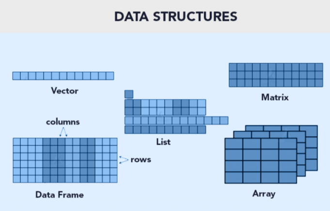
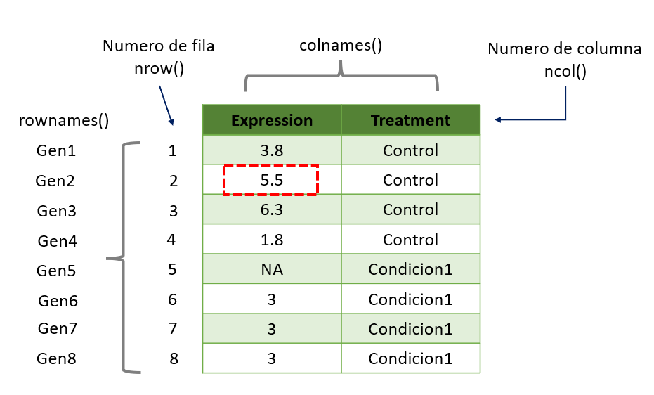

```{r setup, include = FALSE}
# Setup chunk
# Paquetes a usar
#options(htmltools.dir.version = FALSE) cambia la forma de incluir código, los colores

library(knitr)
library(tidyverse)
library(xaringanExtra)
library(icons)
library(fontawesome)
library(emo)

# set default options
opts_chunk$set(collapse = TRUE,
               dpi = 300,
               warning = FALSE,
               error = FALSE,
               comment = "#")

top_icon = function(x) {
  icons::icon_style(
    icons::fontawesome(x),
    position = "fixed", top = 10, right = 10
  )
}

knit_engines$set("yaml", "markdown")

# Con la tecla "O" permite ver todas las diapositivas
xaringanExtra::use_tile_view()
# Agrega el boton de copiar los códigos de los chunks
xaringanExtra::use_clipboard()

# Crea paneles impresionantes 
xaringanExtra::use_panelset()

# Para compartir e incrustar en otro sitio web
xaringanExtra::use_share_again()
xaringanExtra::style_share_again(
  share_buttons = c("twitter", "linkedin")
)

# Funcionalidades de los chunks, pone un triangulito junto a la línea que se señala
xaringanExtra::use_extra_styles(
  hover_code_line = TRUE,         #<<
  mute_unhighlighted_code = TRUE  #<<
)

# Agregar web cam

xaringanExtra::use_webcam()
```

```{r xaringan-editable, echo=FALSE}
# Para tener opciones para hacer editable algun chunk
xaringanExtra::use_editable(expires = 1)
# Para hacer que aparezca el lápiz y goma
xaringanExtra::use_scribble()
```

```{r xaringan-themer, include=FALSE, warning=FALSE}
# Establecer colores para el tema
library(xaringanthemer)
#style_mono_light(base_color = "#562457")
```

class: title-slide, middle, center
background-image: url(imagenes/liigh_unam_logo.png) 
background-position: 10% 10%
background-size: 15% 


.center-column[
# `r rmarkdown::metadata$title`
### `r rmarkdown::metadata$subtitle`

####`r rmarkdown::metadata$author` 
#### `r rmarkdown::metadata$date`
]

---

### Paquetes necesarios

```{r, eval = FALSE}
install.packages("rmarkdown")
install.packages("dplyr")
install.packages("reshape2")
install.packages("remotes")
```

---

class: center, middle

`r fontawesome::fa("code", height = "3em")`
# Estructura de datos / Tipos de datos

---

## Existen 5 estructuras de datos en R

Las estructuras de datos son objetos que contienen datos. Cuando trabajamos con R, lo que estamos haciendo es manipular estas estructuras.

| Tipo        | Declaración de la variable       | Conversión       | Dimensiones  | Contenido               |
|-------------|----------------------------------|------------------|--------------|-------------------------|
| Vector      | c(), seq(), rep(), valorI:valorN; seq_len() | as.vector()      |  1           | homogénea               |
| Lists       | list()                           | as.list()        |  1*          | homogénea               |
| Matrix      | matrix(valores, nrow=x, ncol=y)  | as.matrix()      |  2           | heterogénea             |
| Dataframe   | data.frame()                      | as.dataframe()   |  2           | heterogénea             |

Tambien estan los `array` pero son poco usados en R.

Para conocer la estructura del archivo debes usar `str()`.

Una lista puede contener matrices en su interior, vectores, funciones, etc.

---

.center[

]

---

## Recordatorio: Clases de variables

| Clases    | Declaración de la variable    | Conversión de formato  |                   Reglas                                     |
|-----------|------------------------------|-------------------------|--------------------------------------------------------------|
| numeric   | `numeric()`                  | `as.numeric()`          | FALSE -> 0, TRUE -> 1; "1", "2", ... -> 1,2, ...; "A" -> NA  |
| integer   | `integer()`                  | `as.integer()`          | FALSE -> 0, TRUE -> 1; "1", "2", ... -> 1,2, ...; "A" -> NA  |
| double    | `double()`                   | `as.double()`           |                                                              |
| character | `character()`                | `as.character()`        |  1,2, ... -> "1", "2", ...; FALSE -> "FALSE"; TRUE -> "TRUE"|
| logical   | `logical()`                  | `as.logical()`          | 0 -> FALSE, other numbers -> TRUE; ("FALSE", "F") -> FALSE; ("TRUE", "T") -> TRUE, other character -> NA|
| factor    | `factor()`                   | `as.factor()`           |                                                             |

Si queremos saber la clase de la variable debemos usar `class()`, aunque tambien `str()` te dice esta información. 

> NOTA: `as.integer()` convierte los numeros a enteros. Ejemplo: as.integer(2.5) = 2. En cambio, `as.double()` permite que los numeros contengan decimales.

.left[.footnote[.black[
R for beginners, Página 24
]]]

---

## Recordatorio: Operadores

| Aritméticos              | Comparación               | Argumentos lógicos (Logical Operators)   |
|--------------------------|---------------------------|------------------------------------------|
| `+`  Adición / suma      | `<`  Menor que            | `!x`  - Not x (logical NOT)              |  
| `-`  Sustracción / resta | `>`  Mayor que            | `x & y` OR `x AND y` -  (logical AND)    |                
| `*`  Multiplicación      | `<=` Menor o igual que    | `x && y`  - identico                     |
| `/` OR %% División       | `>=`  Mayor o igual que   | `xor(x,y)`  Funcion OR                   |
| `^` OR ** Exponencial    | `==`  Igual a             | `%in%` pertenece a                       | 
| `%/%` División integral  | `!=`  Diferente de        |                                          |

Otra forma de escrir OR es `x | y` OR `x || y`.

.left[.footnote[.black[
R for beginners, Página 25
]]]

---
## Jerarquía de operaciones

En R, al igual que en matemáticas, las operaciones tienen un orden de evaluación definido.

Cuanto tenemos varias operaciones ocurriendo al mismo tiempo, en realidad, algunas de ellas son realizadas antes que otras y el resultado de ellas dependerá de este orden.


| Orden |  Operadores             | 
|-------|-------------------------|
| 1     |  `^`                    |
| 2     | `* /`                   |
| 3	    | `+ -`                   |
| 4	    | `< > <= >= == !=`       |
| 5     | `!`                     |
| 6	    | `&`                     |
| 7	    | OR                      |

---

name: en-vivo
background-color: var(--morado-claro)
class: middle, center, inverse

`r fontawesome::fa("laptop-file", height = "3em")`
# Manipulación de datos con R base (vector y dataframe) 

---

## Vector: Formas de declarar un vector

```{r}
# Declarar el vector con 5 posiciones (del 1 al 5)
# Opcion A - c()
x <- c(1,2,3,4,5)

# Opcion B - valorI:valorN
x <- 1:5 
x

# Opcion C - seq(inicio, final)
x <- seq(1,5) # 
x

# Opcion D -seq_len(final)
x <- seq_len(5) 
x

# Opcion E - rep(valor, veces)
y <- c(rep(1,5), rep(c(3,5),5))
y
```

---

## Vector: Estructura y clases de variables

Conocer la estructura de un vector mediante la función `str()`. El vector es de tipo `integer` y va de 1 a 5.

```{r}
str(x)
```
Para solo ver el tipo usamos la función `class()`

```{r}
class(x)
```

---

## Ejercicios

```{r}
x <- c(TRUE, TRUE, FALSE, FALSE)
x
x <- as.factor(x)
```

Vamos a crear un nuevo vector con los nombres de los participantes a esta clase

```{r}
ClaseBioinfo <- c("Jose Luis", "Diego", "Rosita", "Yuri", 
                  "Ulises", "Tere", "Chucho")
ClaseBioinfo

# ver estructura
str(ClaseBioinfo)
```

---
## Ejercicios

Extraer información

```{r}
ClaseBioinfo =="Ulises"
ClaseBioinfo =="Chucho"
```

Cuando son mas de un valor usamos `%in%`

```{r}
ClaseBioinfo %in% c("Ulises", "Chucho")
```


---
## Ejercicios

Ahora tambien podemos usar:

```{r eval=FALSE}
ClaseBioinfo == c("Ulises", "Chucho")
```
Podemos declarar un vector de los tratamientos

```{r}
# opcion A
y <- rep(c("Control", "Condicion"),5)
y
# opcion B
y <- c(rep("Control",5), rep("Condicion",5))
y
```

---

## Dataframe: Formas de declarar un vector

```{r}
x <- 1:4
n <- 10
M <- c(10, 35)
y <- 2:4
```

Podemos declarar los componentes de un Dataframe en variables separadas y luego juntarlo o en una sola linea.

```{r}
x <- 1:4; n <- 10; M <- c(10, 35); y <- 2:4
```

Vamos a crear dataframes apartir de estos vectores.

```{r}
data.frame(x, n)
data.frame(x, M)
```

---

## Dataframe en una sola linea

Crear un dataframe en una sola linea, sin declarar cada variable.

```{r}
data.frame(x = 1:4, n = 10)
data.frame(x = 1:4, M = c(10, 35))
```

---

## Dataframe: Ejercicio

- ¿Porque al intentar hacer esta dataframe nos da error?

```{r eval=F}
data.frame(x, y)
# Error in data.frame(x, y) : 
#  arguments imply differing number of rows: 4, 3
```

--

> NOTA: El número de filas y columnas debe ser el mismo número. Existen excepciones al usar paquetes como `dplyr`.

---

## Dataframe: Estructura y clases de variables

Cada columna es una **variable** la cual puede ser de un tipo o clase.

```{r}
df <- data.frame(genes = paste0("Gen", seq_len(8)), 
                 expression = c(3.8, 5.5, 6.3, 1.8, 9, rep(3,3)), 
                 treatment =c(rep("Control", 4), rep("Condicion1",4)))
head(df)
```

Es un dataframe con 3 variables (`genes`, `expression` y `treatment`) y cada uno tiene su propia clase.

```{r}
str(df)
```
---

## Dataframe con los datos de la clase

Vamos a crear un nuevo vector con las edades, llamado `edad`, posteriormente, vamos a combinarlo con el vector que creamos previamente `ClaseBioinfo`

```{r}
# declarar un vector e incorporarlo en el dataframe
edad <- c(31,32, 30, 30, 28, 32, 29)
# Almacenar el dataframe
ClaseBioinfo <- data.frame(ClaseBioinfo, edad)
ClaseBioinfo
```
---

## Agregar una nueva columna en el dataframe

Tambien podemos agregar nuevas columnas usando el simbolo `$` de la siguiente manera:

```{r}
ClaseBioinfo$formacion <- c("medicina", "nutricion", "medicina", 
                            "biologia", "medicina", "medicina", 
                            "biologia")
head(ClaseBioinfo,3)
```

El dataframe tiene 7 filas y 3 columnas.

```{r}
str(ClaseBioinfo)
```

---

## Dataframe, completando espacios faltantes

Cuando creamos la columna `formacion` en el dataframe, al contener 9 elementos el dataframe, R repite 3 veces los valores contenidos en la columna `formacion` para rellenar los 9 espacios.

```{r}
ClaseBioinfo <- c("Jose Luis", "Diego", "Rosita", "Yuri", 
                  "Ulises", "Tere", "Chucho", "Evelia", "Fulanito")
edad <-c(31,32, 30, 30, 28, 32, 29,29,30)
ClaseBioinfo <- data.frame(ClaseBioinfo, edad) # crear dataframe
ClaseBioinfo$formacion <- c("medicina", "nutricion", "medicina")
head(ClaseBioinfo, 3)
```

---

## Ejercicios: 

A partir del siguiente ejemplo, completa los siguientes ejercicios:

```{r, eval=FALSE}
df <- data.frame(genes = paste0("Gen", seq_len(8)), 
                 expression = c(3.8, 5.5, 6.3, 1.8, 9, rep(3,3)), 
                 treatment =c(rep("Control", 4), rep("Condicion1",4)))
```

1) Convierte la columna 3 perteneciente a tratamiento (`treatment`) a `factor`.

> NOTA: En este ejemplo, solo tenemos dos condiciones "Control" y "Condicion1". Por lo que, solo deben hacer dos niveles (levels).

2) Renombra las filas con los nombres de los genes y elimina la columna 1.

> NOTA: Recuerda que para renombrar las filas es `rownames()` y las columnas se usa `colnames()`.

---

## Ejercicios: Respuestas

1) Modifica la columna 3 perteneciente a tratamiento (`treatment`) a `factor`.

```{r}
df$treatment <- as.factor(df$treatment) # conversion a factor
str(df)
```

> NOTA: El signo de dinero `$` nos permite seleccionar una columna (variable) de un dataframe.

--

2) Renombra las filas con los nombres de los genes y elimina la columna 1.

```{r}
rownames(df) <- df$genes # renombrar
df <- df[,-1] # eliminar columna 1
```

---

class: center, middle

`r fontawesome::fa("code", height = "3em")`
# Indexado en R

---

## Index

.pull-left[
Por medio de un **index** podemos: 

- 1) Obtener la información de un dato en específico.
- 2) Modificar un dato en específico.
- 3) Eliminarlo un dato en específico.

Podemos hacer la pregunta de dos maneras, 1) ¿Cuál es el nivel de expresión del Gen2? O 2) ¿Que gen contiene una expresión de 5.5?
]

.center[.pull-right[
]]

---

## Ejercicios

1) **¿Cuál es el nivel de expresión del Gen2?**

> NOTA: Recuerda que un dataframe tiene dos dimensiones 1) fila y 2) columna, dataframe[fila, columna]. Estos nos ayudaran como coordenadas en el dataframe.

```{r}
# Opcion A
df[2,1]

# Opcion B
df$expression[2]

# Opcion C
df["Gen2",]
df["Gen2",1]

# Opcion D
df["Gen2","expression"]
```

---

## Ejercicios

2) **¿Que gen contiene una expresión de 1.8?**

.pull-left[

```{r}
# Opcion A
df[df[, "expression"] == 1.8,]
df[df[, 1] == 1.8,]

# Opcion B
df[df == 1.8,]
```
]

.pull-left[
```{r}
# Opcion C
df[df$expression == 1.8,]

# Opcion D
subset(df, expression == 1.8)
```

]

---

## Index usando un vector

Podemos crear una variable *i* que será nuestro index para extraer valores

```{r}
x <- 1:5
i <- c(1, 3) # el index es numero y nos permite extraer la posicion 1 y 3 del vector
x[i]
```
Usar el vector `i` para obtener las filas 1 y 3

```{r}
df[i,]
```

> NOTA: Recuerda que una matriz esta compuesta de filas y columnas.

---

class: center, middle

`r fontawesome::fa("code", height = "3em")`
# Ejercicios de repaso de Indexado
## Trabajo en equipo

20 min para terminar los 6 ejercicios por equipo o individual


---

## Ejercicio 1 - Vector

```{r eval=FALSE}
# Declarar el vector con 5 posiciones (del 1 al 5)
x <- 1:5
x
# Observar el componente / posicion 3
x[3]
# Observar multiles posiciones
x[c(1,3)]
x[c(1:3,5)] # OR x[-4]
# Sustituir el valor de la posicion 3
x[3] <- 20
x
# Eliminar la posicion 1
x[-1]
```

---

## Ejercicio 2 - Matriz

```{r eval=FALSE}
# Genera una matriz de tamano 2 x 3 (filas, columnas) (rows, columns) 
x <- matrix(1:6, 2, 3)
x

# # Sustituir los valores presentes en la columna 3 de la matriz
x[, 3] <- 21:22
x

# Visualizacion en modo de matriz
x[, 3, drop = FALSE]

# Eliminar la columna 1
x[, -1]

# Eliminar multiples columnas y Visualizacion en modo de matriz
x[, -(1:2), drop = FALSE] # es lo mismo que x[, 3, drop = FALSE]
```

---

## Ejercicio 3 - Lista

```{r eval=FALSE}
# Opcion A
n=c(2, 3, 5) 
s=c("aa", "bb", "cc", "dd", "ee") 
x=list(n, s, 3)
x  
 
 # Opcion B
x <- list(c(2, 3, 5), c("aa", "bb", "cc", "dd", "ee"), 3)
x
```

---

## Ejercicio 4 - Acceder a los elementos de la lista

```{r eval=FALSE}
x[2] # 2do elemento, los datos con titulo
x[[2]] # 2do elemento, solo los datos
x[c(2, 3)] # 2ndo y 3er elemento
```

Acceder a un dato de un elemento

```{r eval=FALSE}
x[[c(2, 3)]] # dato 3 del elemento 2
```

---

## Ejercicio 5 - Operaciones

```{r eval=FALSE}
# Ejercicio 1
x <- 1:10 # Declarar un vector
x[x >= 5] <- 20 # todos los numeros que sean mayor o igual a 5 sustituir por 20
x
# A partir del resultado de x realiza lo siguiente
x[x == 1] <- 25 # todos los numeros que sean igual a 1 sustituir por 25
x

# Ejercicio 2
x <- matrix(1:20, 4, 5) #Genera una matriz de tamano 4 x 5 (filas, columnas) (rows, columns) 
x # Visualizar la matriz
# A partir de la matriz generada realiza lo siguiente
x[, 5] <- 51:54 # 1. ¿Qué cambios existieron en la matriz?
x # Visualizar la matriz de salida
# 2. ¿Cuáles son los valores presentes en la columna 3 de la matriz?
x[, 5]
#3. ¿Como cambia el valor de salida cuando coloco drop= FALSE?
x[, 5, drop = FALSE]
```

---

## Ejercicio 6 - Operaciones

```{r eval=FALSE}
# Ejercicio 3. 
# 1. ¿Como cambia el valor de salida al eliminar la columna 3?
x <- matrix(1:16, 4, 4) #Genera una matriz de tamano 4 x 5 (filas, columnas) (rows, columns) 
x[, -1]
# 2. ¿Como cambia el valor de salida cuando coloco drop= FALSE?
x[, -(1:2), drop = FALSE]
# 3. Renombra las filas y columnas empleando rownames() y colnames(). En fila coloca los nombres: Gen 1, Gen 2, Gen 3 y  Gen 4. Y en columnas coloca los nombres: SRA_1,SRA_2 Y SRA_3

# Ejercicio 4.  Realiza las siguientes operaciones
# 1. Sumatoria
x <- 1:4
y <- 1:2
z <- x + y
z
# 2. Multiplicacion
x <- 1:4
a <- 10
z <- a * x
z
```

---

class: center, middle

`r fontawesome::fa("code", height = "3em")`
# Viernes 16 de febrero 2024  
## Manipulación de datos con R base (matrix y lista)

Gracias por tu atención, respira y coméntame tus dudas. 

