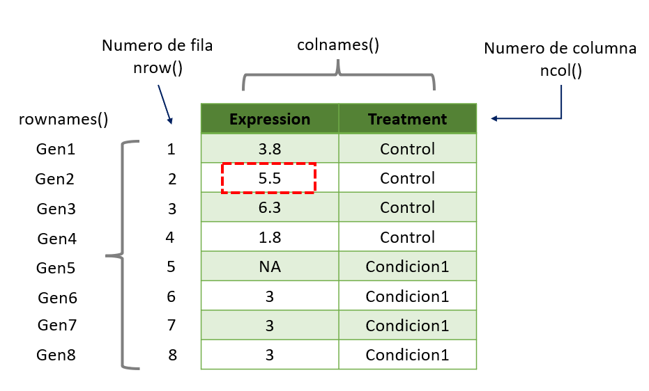

```{r setup, include = FALSE}
# Setup chunk
# Paquetes a usar
#options(htmltools.dir.version = FALSE) cambia la forma de incluir código, los colores

library(knitr)
library(tidyverse)
library(xaringanExtra)
library(icons)
library(fontawesome)
library(emo)

# set default options
opts_chunk$set(collapse = TRUE,
               dpi = 300,
               warning = FALSE,
               error = FALSE,
               comment = "#")

top_icon = function(x) {
  icons::icon_style(
    icons::fontawesome(x),
    position = "fixed", top = 10, right = 10
  )
}

knit_engines$set("yaml", "markdown")

# Con la tecla "O" permite ver todas las diapositivas
xaringanExtra::use_tile_view()
# Agrega el boton de copiar los códigos de los chunks
xaringanExtra::use_clipboard()

# Crea paneles impresionantes 
xaringanExtra::use_panelset()

# Para compartir e incrustar en otro sitio web
xaringanExtra::use_share_again()
xaringanExtra::style_share_again(
  share_buttons = c("twitter", "linkedin")
)

# Funcionalidades de los chunks, pone un triangulito junto a la línea que se señala
xaringanExtra::use_extra_styles(
  hover_code_line = TRUE,         #<<
  mute_unhighlighted_code = TRUE  #<<
)

# Agregar web cam

xaringanExtra::use_webcam()
```

```{r xaringan-editable, echo=FALSE}
# Para tener opciones para hacer editable algun chunk
xaringanExtra::use_editable(expires = 1)
# Para hacer que aparezca el lápiz y goma
xaringanExtra::use_scribble()
```

```{r xaringan-themer, include=FALSE, warning=FALSE}
# Establecer colores para el tema
library(xaringanthemer)
#style_mono_light(base_color = "#562457")
```

class: title-slide, middle, center
background-image: url(imagenes/liigh_unam_logo.png) 
background-position: 10% 10%
background-size: 15% 


.center-column[
# `r rmarkdown::metadata$title`
### `r rmarkdown::metadata$subtitle`

####`r rmarkdown::metadata$author` 
#### `r rmarkdown::metadata$date`
]

---

## Paquetes necesarios

```{r, eval=F}
install.packages("dplyr")    # Manipulación de datos
install.packages("tidyr")    # Manipulación de datos
install.packages("tidyverse")# Manipulación de datos
install.packages("reshape2") # Transformación de datos
install.packages("ggplot2")  # Visualización grafica
install.packages("cowplot")  # Generar varios graficos en una misma figura
```

---

.center[

]

---

## Funciones básicas en R 

| Función        | Empleo              | Documentación | Ejemplos   |
|----------------|---------------------|---------------|------------|
| `sum()`        | Adición / suma      |  `?sum`       | sum(2+7)   |
| `prod()`       | Sustracción / resta |  `?prod`      | prod(9-2)  |
| `max()`        | Valor máximo        |  `?max`       | max(c(1,2,3,4,5))|
| `min()`        | Valor mínimo        |  `?min`       | min(1:5)         |
| `range()`      | Rango               |  `?range`     | range(c(2,8,7,6,1)) |
| `mean()`       | Promedio            |  `?mean`      | mean(c(2,8,7,6,1))         |
| `median()`     | Mediana             |  `?median`    | median(c(2,8,7,6,1))         |
| `var()`        | Varianza            |  `?var`       | var(1:10); var(1:5, 1:5) |
| `cov()`        | Covarianza          |  `?cov`       | cov(1:10, 2:11)|
| `cor()`        | Matriz de correlación  | `?cor`     | cor(1:10, 2:11)|

Existen otras funciones matematicas como `log, exp,log10, log2, sin, cos, tan, asin, acos, atan, abs, sqrt`, etc.

---

## Funciones básicas en R 

| Función        | Empleo                                     | Documentación | Ejemplos                       |
|----------------|--------------------------------------------|---------------|--------------------------------|
| `unique()`     | Valor unico                                | ?unique       | unique(df$expression)          |
| `sort()`       | Ordenar                                    | ?sort         | sort(df$expression)            |
| `order()`      | Ordenar                                    | ?order        | df[order(df$expression),]      |
| `table()`      | cuentas de cada valor en tablas            | ?table        | table(df)                      |
| `subset()`  | Extraer información de una MATRIZ o DATAFRAME | ?subset       | subset(df, expression == 1.8)  |
| `sample()`     | Extraer información de manera aleatoria    | ?sample       | sample(df$expression, size =3) | 
| `length()`     | Número de elementos de un VECTOR           | ?length       | length(df$expression)          |
| `dim()`        | Dimensiones de una MATRIZ o DATAFRAME      | ?dim          | dim(df)                        |
| `is.na()`      | Es un valor NA?                            | ?is.na        | is.na(df)                      |
| `t()`          | Cambiar filas por columnas (transposición) | ?t            | t(df)                          |

.left[.footnote[.black[
R for beginners, Página 32
]]]

---

## Otras funciones importantes son `rbind()` y `cbind()`

Puedes encontrar su documentación empleando `?rbind` y `?cbind`.

### `cbind()`

Podemos unir por las columnas dos vectores.

```{r}
a <- c(1, 3, 3, 4, 5)
b <- c(7, 7, 8, 3, 2)
new_matrix <- cbind(a, b)
new_matrix
```


---

### `cbind()`

Crear un dataframe

```{r}
df <- data.frame(genes = paste0("Gen", seq_len(8)), 
                 expression = c(3.8, 5.5, 6.3, 1.8, 9, rep(3,3)), 
                 treatment =c(rep("Control", 4), rep("Condicion1",4)))
```

Tambien podemos incorporarle una nueva columna a un *dataframe*

```{r}
date_sample <- rep(c(11, 12, 13, 14),2)
df_new <- cbind(df, date_sample)
head(df_new)
```

---

### `rbind()`

Vamos a unir dos *dataframe* pero ambos deben tener el mismo numero y nombre en su columnas. 

> NOTA: Los rownames deben ser Únicos, por lo que no debemos comenzar desde el Gen1.

```{r}
df_v2 <- data.frame(genes = paste0("Gen", 9:16), 
                 expression = c(6.1, 6.2, 5, 2, 7, rep(8,3)), 
                 treatment =c(rep("Control", 4), rep("Condicion1",4)))

df_v2$treatment <- as.factor(df_v2$treatment) # conversión a factor
#unir
df_new <- rbind(df, df_v2)
head(df_new)
```

---

## Información de la estructura de un dataframe

Para ver su estructura e información:

```{r eval=F}
dim(df)    # dimensiones [fila, columna]
length(df) # largo, número de columnas
ncol(df)   # número de columnas
nrow(df)   # número de filas
names(df)  # nombre de las columnas
str(df)    # Estructura
```

--

Podemos adornar la salida colocando estas notas.

```{r}
cat("Dimensiones:", dim(df), "\n")
cat("Numero de columnas:", ncol(df), "\n")
cat("Numero de filas:", nrow(df), "\n")
cat("Nombre de las columnas:", names(df), "\n")
```

> NOTA: El "\n" indica saltos de linea en el texto.


---

## Función `which()`

Podemos usar esta función para extraer la información y/o las posiciones que cumpla con un argumento logico.

Documentación `?which`

```{r}
x <- c(1, 5, 4, 8, 4) 
which(x == 4 | x == 1)  # condicional que sea igual a 4 o a 1
```

**¿Cuántos números son iguales a 4 y a 1?**

```{r}
length(which(x == 4 | x == 1))   
```

---

## Función `which()` en un matriz

### Ejemplo 1: Obtener las valores que al divirse entre 3 sean iguales a cero

```{r}
m <- matrix(1:12, 3, 4) # Generar una matriz de 3 x 4

# Opción A - con R base
m[m %% 3 == 0]
# Opción B - con la función which
div.3 <- m %% 3 == 0 
which(div.3) # OR which(m %% 3 == 0)
```

---

## Función `which()` en un matriz

### Ejemplo 2: Obtener las posiciones de los numeros que al divirse entre 3 sean iguales a cero


```{r}
# Para obtener la información de las posiciones podemos usar:
which(div.3, arr.ind = TRUE)

# Ejemplo 2
rownames(m) <- paste("Case", 1:3, sep = "_") # renombrar las filas
which(m %% 5 == 0, arr.ind = TRUE) # Extraer las posiciones que cumplan con la condición logica
```

---

## Index

.pull-left[
Por medio de un **index** podemos: 

- 1) Obtener la información de un dato en específico.
- 2) Modificar un dato en específico.
- 3) Eliminarlo un dato en específico.

Podemos hacer la pregunta de dos maneras, 1) ¿Cuál es el nivel de expresión del Gen2? O 2) ¿Que gen contiene una expresión de 5.5?
]

.center[.pull-right[
]]

---

## Función `which()` en un dataframe

**¿Que gen contiene una expresión de 1.8?**

```{r}
# Opción A
which(df == 1.8, arr.ind = TRUE)
```

```{r}
# Opción B
df[which(df$expression == 1.8), ]
```

---


class: center, middle

`r fontawesome::fa("code", height = "3em")`
# Repaso de todo lo aprendido en clases
## Ejercicio practico

---

class: center, middle

# Paso 1.  Crear un RBioProject

---

class: center, middle

`r fontawesome::fa("code", height = "3em")`
# Marvel vs DC comics

.center[.pull-right[
]
]

.center[.pull-left[
]
]

---

## Paso 2. Descargar los datos y verificar su ubicación en la carpeta `data/`

1) Descarga los tres datasets de Marvel dando click en este [link](https://github.com/cosmoduende/r-marvel-vs-dc/tree/main/dataset_shdb), debes tener tres archivos en la misma carpeta `charactersStats.csv`, `heroesInformation.csv` y `superHeroPowers.csv`. Asegúrate de guardarlo en el directorio donde hiciste tu Rproject. En mi caso, guarde los datos en la carpeta `data/`.

2) Verifica que se encuentren los tres archivos en la carpeta `data/`.

```{r}
dir("data")
```

---

## Paso 3. Importar los datos en R

3) Importa los archivos en R de la siguiente manera:

```{r eval=F}
infoCharacters <- read.csv("data/heroesInformation.csv", na.strings = c("-", "-99")) 
# La opción na.string nos permite sustituir valores - y -99 por NA
infoPowers <- read.csv("data/superHeroPowers.csv")
infoStats <- read.csv("data/charactersStats.csv", na.strings = "")
```

Visualiza su información con `head()` o `View()`.

> **NOTA:** Primero debes crear la carpeta data/ antes de descargar los archivos.

---

## Buenas prácticas

Nuestro script debe verse asi:

```{r}
######
# Script de clase "Intro a R"
# Evelia Coss
# 8 de marzo 2024
#######

indir = "C:/Users/ecoss/OneDrive - CINVESTAV/Documentos/Posdoc_LIIGH/VieRnesBioinfo/ViernesBioinfo_2024/Presentaciones/data/"
outdir = "C:/Users/ecoss/OneDrive - CINVESTAV/Documentos/Posdoc_LIIGH/VieRnesBioinfo/ViernesBioinfo_2024/Presentaciones/"

# Importar datos
infoCharacters <- read.csv(paste0(indir,"heroesInformation.csv"), na.strings = c("-", "-99")) 
# La opción na.string nos permite sustituir valores - y -99 por NA
infoPowers <- read.csv(paste0(indir,"superHeroPowers.csv"))
infoStats <- read.csv(paste0(indir,"charactersStats.csv"), na.strings = "")
```

---

## Paso 4. Renombrar la columna **Name** en todos los dataframe

Vamos a unificar el nombre las columnas que tienen los nombre en todas las columnas colocando el nombre Name. El dataframe infoStats ya contiene ese nombre en la columna 1.

```{r}
colnames(infoCharacters)[colnames(infoCharacters) == "name"] <- "Name"
colnames(infoPowers)[colnames(infoPowers) == "hero_names"] <- "Name"
```

---

## Paso 5. Seleccionar SOLO los datos de Marvel Comics y DC Comics

Podemos usar la función `unique()` para obtener los **valores únicos** en un vector o de una columna en un dataframe.

```{r}
# Empresas comprendidas en esta base de datos
unique(infoCharacters$Publisher)
```

---

## Paso 5. Seleccionar SOLO los datos de Marvel Comics y DC Comics

Filtrar solo los datos de Marvel Comics y DC Comics.

```{r}
marvelDcInfo <- infoCharacters[(infoCharacters$Publisher == "Marvel Comics" | infoCharacters$Publisher == "DC Comics"), ]
head(marvelDcInfo, 3)
```

---

## Verificamos las dimensiones

Esperariamos que cada fila sea un solo personaje, pero este dataframe contiene nombres repetidos.

```{r}
dim(marvelDcInfo)
```

Esperariamos que las **filas representaran el numero de personales**, teniendo un total de `r dim(marvelDcInfo)[1]` personajes y las **columnas representaran las variables**, teniendo un total de `r dim(marvelDcInfo)[2]` variables.

Sin embargo, podemos extraer los nombres de los personajes que solo se repitan una vez y veremos que nuestro dataset no esta limpio. Ya que solo tiene un total de `r length(unique(marvelDcInfo$Name))` personajes.

```{r}
length(unique(marvelDcInfo$Name))
```

---

## Observar valores duplicados

Observar cuales se duplican mediante la función [`duplicated()`](https://www.rdocumentation.org/packages/base/versions/3.6.2/topics/duplicated) de R base.

```{r}
head(marvelDcInfo[duplicated(marvelDcInfo$Name), ], 3)
```
Para saber cuantos personajes duplicados podemos usar `length()`

```{r}
length(marvelDcInfo[duplicated(marvelDcInfo$Name), ])
```
Existen `r length(marvelDcInfo[duplicated(marvelDcInfo$Name), ])` personajes que se encuentran duplicados en esta base de datos.

---

## Revisemos un ejemplo de datos duplicados

Vamos a obtener la información de **Batman** y vemos que tiene dos filas pertenecientes al mismo personaje.

```{r}
# Opción A
marvelDcInfo[marvelDcInfo$Name == "Batman", ]
```
Tambien podemos usar la función `subset()` para extraer información de algun personaje.

```{r}
# Opción B
subset(marvelDcInfo, Name == "Batman")
```

---

# Empecemos con la limpieza de los datos

## Paso 6. Eliminar duplicados

El signo de exclamación `!` nos permite indicar lo contrario, es decir, devolverme todos los que no esten duplicados seria asi `!duplicated()`.

```{r}
marvelDcInfo <- marvelDcInfo[!duplicated(marvelDcInfo$Name), ]
```

## Paso 7. Seleccionar columnas


```{r}
marvelDcInfo <- marvelDcInfo[, c("Name", "Gender", "Race", "Publisher")]
head(marvelDcInfo, 3)
```

---

## Paso 8. Cambiar formatos en algunas columnas

Debemos convertir las columnas `Name`, `Gender`, `Race` y `Publisher` de character a factor.

```{r}
str(marvelDcInfo)
```
Para cambiar a factor usamos la función `as.factor()`.

```{r}
marvelDcInfo$Name <- as.factor(marvelDcInfo$Name)
marvelDcInfo$Gender <- as.factor(marvelDcInfo$Gender)
marvelDcInfo$Race <- as.factor(marvelDcInfo$Race)
marvelDcInfo$Publisher <- as.factor(marvelDcInfo$Publisher)
```

---

## Ejercicios

1) ¿Cuántos personajes hay por cada empresa?

2) ¿Cuántos personajes son mujeres y hombres hay por cada empresa?
 
3) ¿Cuántas razas hay en el dataframe?

4) ¿Cuáles son las razas predominantes de cada empresa?

---

## Ejercicios

1) ¿Cuántos personajes hay por cada empresa?

### Opción A

```{r}
summary(marvelDcInfo$Publisher)
```

### Opción B

```{r}
table(marvelDcInfo$Publisher)
```

---

## Ejercicios

2) ¿Cuántos personajes son mujeres y hombres hay por cada empresa?

### DC Comics

```{r}
cat("DC Comics, hombres:", nrow(subset(marvelDcInfo, Publisher == "DC Comics" & Gender == "Male")), "\n")
cat("DC Comics, mujeres:", nrow(subset(marvelDcInfo, Publisher == "DC Comics" & Gender == "Female")), "\n")
```
## Marvel

```{r}
cat("Marvel, hombres:", nrow(subset(marvelDcInfo, Publisher == "Marvel Comics" & Gender == "Male")), "\n")
cat("Marvel, mujeres:", nrow(subset(marvelDcInfo, Publisher == "Marvel Comics" & Gender == "Female")), "\n")
```

---

## Ejercicios

3) ¿Cuántas razas hay en el dataframe?

### Opción A

Eliminamos los `NA` que tengamos con `!is.na()`, posteriormente, obtenemos los nombres unicos y medimos.

```{r}
length(unique(marvelDcInfo$Race[!is.na(marvelDcInfo$Race)]))
```
### Opción B

Como esta columna se encuentra en factores, podemos ver el numero de niveles con a funcion `nlevels()`.

```{r}
nlevels(marvelDcInfo$Race)
```

---

## Ejercicios

4) ¿Cuáles son las razas predominantes de cada empresa?

Podemos usar la función [`sort()`](https://www.rdocumentation.org/packages/base/versions/3.6.2/topics/sort) para ordenar los datos de mayor a menor, usando el argumento `decreasing = TRUE`.

La raza ***Human o humana*** es la mas predominante en ambas empresas, seguida de la mutante en el caso de Marvel Comics.

```{r}
head(sort(table(marvelDcInfo$Race), decreasing = TRUE), 10)
```

---

# Guardar variables para la siguiente clase

Guardar una sola variable

```{r, eval=FALSE}
save(marvelDcInfo, file = "Presentaciones/data/marvelDcInfo.RData")
```

Guardar varias variables

```{r, eval=FALSE}
save(infoStats, infoPowers, marvelDcInfo, file = "Presentaciones/data/Info_data.RData")
```
---

class: center, middle

`r fontawesome::fa("code", height = "3em")`
# Viernes 15 de marzo 2024  
## Manipulación de datos usando dplyr 

Gracias por tu atención, respira y coméntame tus dudas. 

