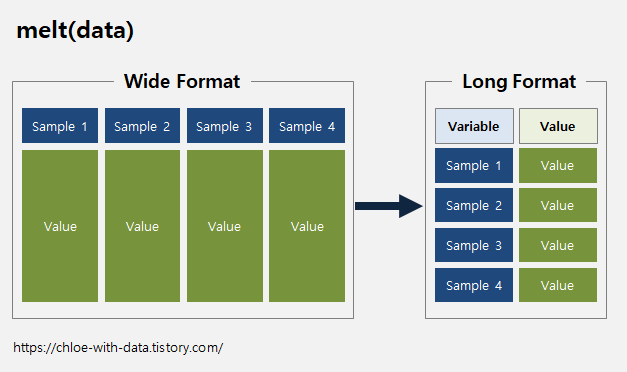
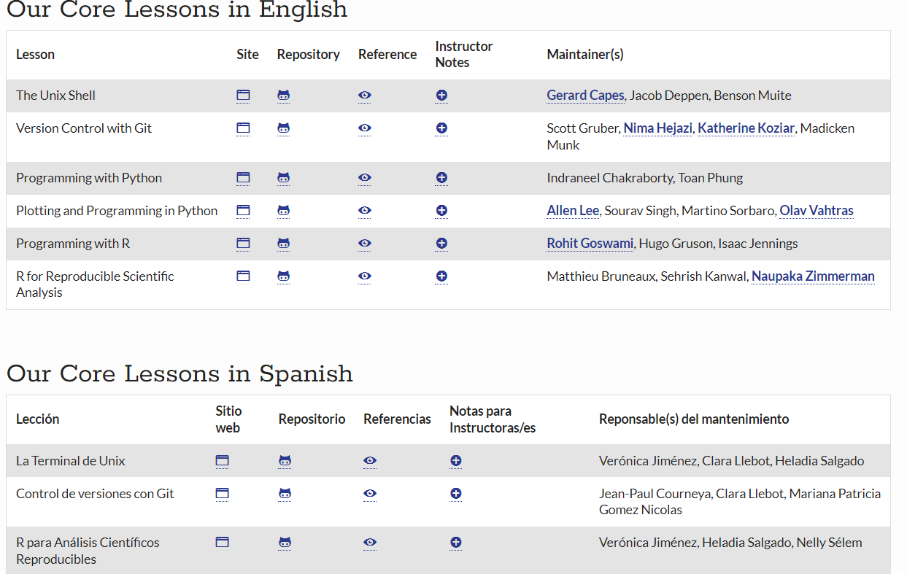

```{r setup, include = FALSE}
# Setup chunk
# Paquetes a usar
#options(htmltools.dir.version = FALSE) cambia la forma de incluir código, los colores

library(knitr)
library(tidyverse)
library(xaringanExtra)
library(icons)
library(fontawesome)
library(emo)

# set default options
opts_chunk$set(collapse = TRUE,
               dpi = 300,
               warning = FALSE,
               error = FALSE,
               comment = "#")

top_icon = function(x) {
  icons::icon_style(
    icons::fontawesome(x),
    position = "fixed", top = 10, right = 10
  )
}

knit_engines$set("yaml", "markdown")

# Con la tecla "O" permite ver todas las diapositivas
xaringanExtra::use_tile_view()
# Agrega el boton de copiar los códigos de los chunks
xaringanExtra::use_clipboard()

# Crea paneles impresionantes 
xaringanExtra::use_panelset()

# Para compartir e incrustar en otro sitio web
xaringanExtra::use_share_again()
xaringanExtra::style_share_again(
  share_buttons = c("twitter", "linkedin")
)

# Funcionalidades de los chunks, pone un triangulito junto a la línea que se señala
xaringanExtra::use_extra_styles(
  hover_code_line = TRUE,         #<<
  mute_unhighlighted_code = TRUE  #<<
)

# Agregar web cam

xaringanExtra::use_webcam()
```

```{r xaringan-editable, echo=FALSE}
# Para tener opciones para hacer editable algun chunk
xaringanExtra::use_editable(expires = 1)
# Para hacer que aparezca el lápiz y goma
xaringanExtra::use_scribble()
```

```{r xaringan-themer, include=FALSE, warning=FALSE}
# Establecer colores para el tema
library(xaringanthemer)
#style_mono_light(base_color = "#562457")
```

class: title-slide, middle, center
background-image: url(imagenes/liigh_unam_logo.png) 
background-position: 10% 10%
background-size: 15% 


.center-column[
# `r rmarkdown::metadata$title`
### `r rmarkdown::metadata$subtitle`

####`r rmarkdown::metadata$author` 
#### `r rmarkdown::metadata$date`
]

---

## Paquetes necesarios

Ya deben tenerlos instalados previo a la clase

```{r, eval = FALSE}
install.packages("dplyr")    # Manipulación de datos
install.packages("tidyr")    # Manipulación de datos
install.packages("tidyverse")# Manipulación de datos

install.packages("reshape2") # Transformación de datos
install.packages("ggplot2")  # Visualización grafica
install.packages("cowplot")  # Generar varios graficos en una misma figura
```

---

## Cargar paquetes

```{r message=FALSE}
library(dplyr)     # Manipulación de datos
library(tidyr)     # Manipulación de datos
library(tidyverse) # Manipulación de datos

library(reshape2)  # Transformación de datos
library(cowplot)   # Visualización grafica
library(ggplot2)   # Generar varios graficos en una misma figura
```

---
class: center, middle

`r fontawesome::fa("code", height = "3em")`
# Marvel vs DC comics

.center[.pull-right[
]
]

.center[.pull-left[
]
]

---
## Paqueterias importantes en la Manipulación de datos en R

- Tidyverse packages
  - tidyr
  - dplyr
  - ggplot2
  - readr
  - purrr
  - tibble
  - stringr
  - forcats
  
Cada paquete contiene sus propias instalaciones, aunque al instalar el paquete `Tidyverse`, algunas funciones podrían compartirse con los demás paquetes. 

> **NOTA:** Cuando queremos evitar chocar entre paquetes indicamos de donde viene la funcion, ejemplo: `dplyr::select()`.

Para más información pueden visitar su [sitio web](https://www.tidyverse.org/packages/).

---

##  %>% pipeline

Empleando el paquete `Tidyverse` y `dplyr` puedes acceder a usar `%>%`, el cual nos permitirá enlazar funciones en la modificación de un dataframe. 

```{r}
df <- data.frame(genes = paste0("Gen", seq_len(8)), 
                 expression = c(3.8, 5.5, 6.3, 1.8, 9, rep(3,3)), 
                 treatment =c(rep("Control", 4), rep("Condicion1",4)))

df %>% head()
```

---

## Archivo tipo `Tibble`

Cuando trabajamos con los paquetes provenientes de `Tidyverse` los archivos de salida por lo regular son tipo `tibble`, que es parecido a un dataframe, pero puede chocar con algunas paqueterias para manipulacion de dataframe.

Por lo que regularmente convertimos esta salida a dataframe usando `as.data.frame()`


Para más información revisa el paquete [tibble](https://tibble.tidyverse.org/).

---

## Funciones que vamos a emplear de `dplyr`

.content-box-gray[
- `select()` : Seleccionar nombres de las columnas. --> select(dataframe, columna1, columna2, ... columnax)
- `filter()` : Filtrar filas por una condicion especifica, apartir de la columna. --> filter(dataframe, columna1 == "condicion")
- `mutate()` : Modificar o agregar columnas. --> mutate(dataframe, columna1 = "condicion")
- `group_by()` : Agrupar informacion de acuerdo a un(as) columna(s) seleccionada(s). 
- `if_else()` : Condicional. --> if_else(dataframe, codicion, si se acepta entonces, si se rechaza entonces)
- `arrange()` : Acomodar los resultados, default de menor a mayor.
- `count()`: Cuenta los valores de acuerdo a una variable.
- `left_join()` : Unir dos dataframe con base en una misma columna en comun. --> left_join(dataframe1, dataframe2, by  = "Columna en comun, mismo nombre")
- `n_distinct()` : Cuenta las filas unicas.
- `distinct()` : Muestra las filas duplicadas.
- `summarise()` : reduce varios valores seleccionados en un resumen.
]

Para más información visita el [Github del paquete dplyr](https://github.com/cran/dplyr).

Para ver todas las funciones existentes del paquete puede ver el [Cheat Sheet](https://raw.githubusercontent.com/rstudio/cheatsheets/main/pngs/thumbnails/data-transformation-cheatsheet-thumbs.png).

---

## Funciones que vamos a emplear de `reshape2`

.content-box-gray[
- `melt()` : Modificación el formato de un dataframe.
]

Para más información visita el [Github del paquete reshape2](https://github.com/cran/reshape2). Aunque este paquete se encuentra descontinuado, aun funcionan las funciones. Fue absorbido posteriormente por el paquete `tidyr`.

Se supone que la función `gather()` del paquete `tidyr` realiza lo mismo que `melt()` del paquete `reshape2`. Hoy lo compararemos ambas. 

Para más información visita el [Github del paquete tidyr](https://tidyr.tidyverse.org/).

---

## Funciones para unir dataframes con el paquete `dplyr`

.center[
]

---

class: center, middle

`r fontawesome::fa("file-code", height = "3em")`
# En la clase anterior vimos ...

---

# En la Clase 6 vimos:

- **Paso 1.** Crear un RBioProject

- **Paso 2.** Descargar los datos y verificar su ubicación en la carpeta `data/`

- **Paso 3.** Importar los datos en R

- **Paso 4.** Renombrar la columna Name en todos los dataframe

- **Paso 5.** Seleccionar SOLO los datos de Marvel Comics y DC Comics

- **Paso 6.** Eliminar duplicados

- **Paso 7.** Seleccionar columnas

- **Paso 8.** Cambiar formatos en algunas columnas

Todos estos pasos se encuentran en el Script [MarvelvsDCComics_limpieza_script.R](https://github.com/EveliaCoss/ViernesBioinfo2024/blob/main/Practica_Clase6y7/MarvelvsDCComics_limpieza_script.R).

---

class: center, middle

`r fontawesome::fa("code", height = "3em")`
# Manipulación de datos

---

## Importar datos en R

Partiendo del código que ya conocemos, continuamos con el **Script**.

```{r}
######
# Script de clase "Intro a R"
# Evelia Coss
# 8 de marzo 2024
#######

indir = "C:/Users/ecoss/OneDrive - CINVESTAV/Documentos/Posdoc_LIIGH/VieRnesBioinfo/ViernesBioinfo_2024/Presentaciones/data/"
outdir = "C:/Users/ecoss/OneDrive - CINVESTAV/Documentos/Posdoc_LIIGH/VieRnesBioinfo/ViernesBioinfo_2024/Presentaciones/"

# Cargar las variables infoPowers, infoStats, marvelDcInfo
load(file =  paste0(indir, "Info_data.RData"))
```

El archivo [`Info_data.RData`](https://github.com/EveliaCoss/ViernesBioinfo2024/blob/main/Practica_Clase6y7/Info_data.RData) lo creamos en la clase pasada, por ello, solo cargaremos este archivo.

---

## Paso 9. Unir dataframes con base en una columna en común (Join Datasets)


Iniciamos con 3 dataframes (`infoCharacters, infoStats` e `infoPowers`). A partir del dataframe `infoCharacters` seleccionamos solo los datos de **Marvel Comics y DC Comics**, limpiamos los duplicados y almacenamos en la variable `marvelDcInfo`.

> **Primera unión**, empleando la columna `Name` contenida en ambos dataframes. Se unieron las columnas seleccionadas con la información básica de cada personaje con los stats de cada uno.

```{r}
marvelDcStatsInfo <- left_join(marvelDcInfo, infoStats, by = "Name")
head(marvelDcStatsInfo)[1:5]
```

---

## Paso 9. Unir dataframes con base en una columna en común (Join Datasets)

> **Segunda unión**, empleando la columna `Name`. Se el dataframe generado co la informacion de los poderes por cada personaje.

```{r}
fullMarvelDc <- left_join(marvelDcStatsInfo, infoPowers, by = "Name")
head(fullMarvelDc)[1:5]
```

---

## Paso 10. Cambiar formatos en algunas columnas

```{r}
fullMarvelDc$Name <- as.factor(fullMarvelDc$Name)
fullMarvelDc$Alignment <- as.factor(fullMarvelDc$Alignment)
```

Si usamos `str()` tendremos desplegado la informacion de todas las 179 columnas presentes en el dataframe, recuerda que puedes usar `dim()` para checar las dimensiones.

```{r}
dim(fullMarvelDc)
```

---

## Verificamos los formatos con `class()`

```{r}
class(fullMarvelDc$Name)
class(fullMarvelDc$Gender)
class(fullMarvelDc$Race)
class(fullMarvelDc$Publisher)
class(fullMarvelDc$Alignment)
```

---

class: center, middle

`r fontawesome::fa("terminal", height = "3em")`
# Ejercicios
## Vamos a resolver juntos los siguientes ejercicios

---
## Ejercicios

1) ¿Cuántos individuos tenemos de cada género (Gender), considerando su raza (Race) y empresa (Publisher)?

2) ¿Cuántos personajes villanos, neutrales y héroes (su bando, Aligment) por cada empresa?

3) ¿Cuántos individuos tenemos de cada género (Gender), considerando su bando (Aligment) y empresa (Publisher)?

---
## Ejercicios: RESPUESTAS

1) ¿Cuántos individuos tenemos de cada género (Gender), considerando su raza (Race) y empresa (Publisher)?


.scroll-box-14[

```{r}
fullMarvelDc %>% filter(!is.na(Race)) %>%
  group_by(Publisher, Gender) %>%
  dplyr::count(Race) %>%
  select(Publisher, Gender, Race,  Count = n) %>%
  arrange(-Count) # ordenar de max a min
```

]

---
## Ejercicios: RESPUESTAS

2) ¿Cuántos personajes villanos, neutrales y héroes (su bando, Aligment) por cada empresa?

```{r}
marvelDcAlignment <- fullMarvelDc %>% filter(!is.na(Alignment)) %>%
  group_by(Publisher) %>%
  dplyr::count(Alignment) %>%
  select(Publisher, Alignment,  Count = n) %>%
  arrange(-Count) # ordenar de max a min

marvelDcAlignment
```

---
## Ejercicios: RESPUESTAS

3) ¿Cuántos individuos tenemos de cada género (Gender), considerando su bando (Aligment) y empresa (Publisher)?

.scroll-box-14[

```{r}
# Y si le agregamos sexo?
fullMarvelDc %>% filter(!is.na(Alignment) & !is.na(Gender)) %>%
  group_by(Publisher, Gender) %>%
  dplyr::count(Alignment) %>%
  select(Publisher, Gender, Alignment,  Count = n) %>%
  arrange(-Count) # ordenar de max a min
```
]

---
class: center, middle

`r fontawesome::fa("code", height = "3em")`
# Continuación de la manipulación de datos
## Marvel vs DC comics

---

## Esto es lo que realiza `melt()`

.center[
]


---

## Paso 11. Transformar en una sola columna los poderes usando `melt()`

Reacomodar la tabla de acuerdo a las habilidades o poderes.

La función `melt()` te permite acomodar la tabla, cambiando el formato de la misma de acuerdo a las habilidades o poderes.

.scroll-box-14[

```{r}
marvelDc <- melt(fullMarvelDc, id = c("Name", "Gender", "Race", "Publisher", "Alignment", "Intelligence.x", 
                                         "Strength", "Speed", "Durability.x", "Power", "Combat", "Total"))

str(marvelDc)
```
]

---

## Checamos los cambios en el contenido

Se redujo el numero de columnas y las columnas seleccionados se compactaron en una sola columna. Se agrego la columna `value` con valores de TRUE y FALSE, considerando si el personaje tenia o no la habilidad.

```{r}
head(marvelDc, 3)
```

---

## Al usar `melt()` se reduce el numero de columnas en 2

```{r}
dim(marvelDc)
```

Se redujeron de 179 columnas a 14 columnas. Creando 2 nuevas columnas:

1) `variable` :  Contiene el nombre de los poderes.

2) `value` : Contiene valores lógicos de acuerdo a cada poder de los personajes.

---

## Paso 12. Renombrar la columnas

```{r}
head(marvelDc, 3)
```

Vamos a renombrar la columna `variable` por `SuperPower`.

```{r}
colnames(marvelDc)[colnames(marvelDc) == "variable"] <- "SuperPower" # Renombrar columna
```

A veces el paquete `dplyr` cambia el nombre de algunas columnas solo agregando `.x`, no es preocupante y podemos corregirlo de la siguiente manera.

```{r}
# Corregir nombres de columnas
colnames(marvelDc)[colnames(marvelDc) == "Intelligence.x"] <- "Intelligence"  # Renombrar columna
colnames(marvelDc)[colnames(marvelDc) == "Durability.x"] <- "Durability"  # Renombrar columna
```

---

## Cambiamos el formato de las columnas

En caso de que las siguientes columnas no se encuentren convertidas.

```{r Cambiar formatos de marvelDc}
marvelDc$Name <- as.factor(marvelDc$Name)
marvelDc$Gender <- as.factor(marvelDc$Gender)
marvelDc$Race <- as.factor(marvelDc$Race)
marvelDc$Publisher <- as.factor(marvelDc$Publisher)
marvelDc$Alignment <- as.factor(marvelDc$Alignment)
marvelDc$SuperPower <- as.factor(marvelDc$SuperPower)
```

---

## Verificar el formato de las columnas

```{r}
class(marvelDc$Name)
class(marvelDc$Gender)
class(marvelDc$Race)
class(marvelDc$Publisher)
class(marvelDc$Alignment)
class(marvelDc$SuperPower)
```

---

## Paso 13. Selección de habilidades con TRUE

```{r}
marvelDc <- marvelDc %>%
  filter(value == "True") %>%
  select(-value) #eliminar columna

head(marvelDc)
```

---

## Ejercicios

1) ¿Quiénes son los personajes con más habilidades/poderes por cada empresa?

```{r}
marvelDc %>% group_by(Name, Publisher) %>%
  distinct(SuperPower) %>%
  dplyr::count(Publisher) %>%
  select(Name, Publisher,  Count = n) %>%
  arrange(-Count) %>% # ordenar de max a min
  head(3)
```

Spectre es el personaje con más habilidades a comparación de los demás personajes.

> NOTA:  Cuando usamos el simbolo `-` en la funcion `arrange()` para ordenar de mayor a menor los valores.

---

## Ejercicios

1) ¿Quiénes son los personajes con más habilidades/poderes por cada empresa?

Sin embargo, ser el más habilidoso no implica el más poderoso...Si observamos sus stats todos son de 1 o menos.

.scroll-box-14[
```{r}
marvelDc %>% filter(Name == "Spectre")
```
]

Es el personaje con más habilidades, pero tiene sus stats muy bajos.

---
## Ejercicios

2) ¿Quiénes son los personajes con los stats más altos por cada empresa?

```{r}
marvelDc %>% arrange(-Intelligence, -Strength, -Speed, -Durability, -Power, -Combat) %>%
  select(-SuperPower) %>%
  distinct() %>% head(5)
```


> NOTA:  Cuando usamos el simbolo `-` en la funcion `select()` estamos eliminando la columna SuperPower.

---

## Ejercicios

3) ¿Existe algún personaje que tenga todos sus stats en 100?

Hay 6 columnas de stats evaluados que sumados nos da la columna Total, osea que los valores maximos se encuentran cercanos a 600 (columnas 6:11).

```{r}
# Opcion B
marvelDc %>% select(-SuperPower) %>% distinct() %>% # eliminas duplicados
  filter(Intelligence >= 100 & Strength >= 100 & Speed >= 100 & Durability >= 100 & Power >= 100 & Combat >= 100)

```

La salida da NINGUNO, ya que no existe un personaje que tenga los 6 Stats con valores de 100.

---

## Ejercicios

Vamos a disminuir el filtro en valores cercanos o iguales a 90.

```{r}
# Personaje con stats superiores a 90 en cada uno
marvelDc %>% select(-SuperPower) %>% distinct() %>% # eliminas duplicados
  filter(Intelligence >= 90 & Strength >= 90 & Speed >= 90 & Durability >= 90 & Power >= 90 & Combat >= 90)

```

---

## Ejercicios

Y si filtramos por el valor total ... 

```{r}
# Y si filtramos 
# Personas con valores totales superiores a 570
marvelDc %>% select(-SuperPower) %>% distinct() %>% # eliminas duplicados
  filter(Total >= 570)
```

---

## Paso 14. Renombrar el formato de Alignment

Cuando usamos la función `if_else()` la empleamos para asignar valores de acuerdo a una conducional.

- Usage: if_else(condición, TRUE, FALSE)
  - Condición: Selecciona una columna y verifica que debe cumplir la misma.
  - TRUE: En caso de que la condición sea VERDADERA, que acción debe hacer.
  - FALSE: En caso de que la condición sea FALSA, que acción debe hacer 

Vamos agregar una nueva columna y vamos a cambiar los valores a usar el bando (Aligment)

```{r}
# Opcion A - Función `if_else()`
marvelDc_edited <- marvelDc %>% mutate(Group = 
                    if_else(Alignment == "good", "hero", # Primer if_else
                          if_else(Alignment == "bad","villain", "neutral"))) # Segundo if_else
```

Tambien podemos usar `case_when()`

```{r, eval=FALSE}
# Opcion B - Funcion `case_when()`
marvelDc_edited <- marvelDc %>% mutate(Group = 
                   case_when(Alignment == "good" ~ "hero", 
                             Alignment == "bad" ~ "villain", 
                             TRUE ~ "neutral"))
```

---

## Ejercicio: Función `if_else()`

¿Quiénes son los hombres más poderosos y malvados?

```{r}
marvelDc_edited %>% select(-SuperPower) %>% distinct() %>% # eliminas duplicados
  filter(Gender == "Male" & Group == "villain") %>%
  arrange(-Total)
```

---

# Guardar el output

Vamos a almacenar la variable `marvelDc_edited` la cual ya se encuentra limpia de duplicados y mantiene todas las ediciones que le hemos hecho.

```{r, eval=FALSE}
save(marvelDc_edited, file = "Presentaciones/data/marvelDc_edited.RData")
```

---

## En esta clase vimos:

- **Paso 9.** Unir dataframes con base en una columna en común (Join Datasets)

- **Paso 10.** Cambiar formatos en algunas columnas

- **Paso 11.** Transformar en una sola columna los poderes usando `melt()`

- **Paso 12.** Renombrar la columnas

- **Paso 13.** Selección de habilidades con TRUE

- **Paso 14.** Renombrar el formato de Alignment

Todos estos pasos se encuentran en el script [MarvelvsDCComics_Join_script.R](https://github.com/EveliaCoss/ViernesBioinfo2024/blob/main/Practica_Clase6y7/MarvelvsDCComics_Join_script.R).

---

class: center, middle

`r fontawesome::fa("gears", height = "3em")`
# Ejercicios de Manipulación de datos
## Trabajo en equipo o individual

20 min para terminar todos los ejercicios por equipo

---

## Ejercicios

1) ¿Quiénes son los personajes más fuertes de cada empresa?

2) ¿Quiénes son los personajes más inteligentes de cada empresa?

3) ¿Quiénes son las mujeres más poderosas y malvadas?

4) ¿Quiénes son los hombres más poderosos y malvados?

---
## Ejercicios: RESPUESTAS

1) ¿Quiénes son los personajes más fuertes de cada empresa?

```{r}
marvelDc %>% filter(!is.na(Strength)) %>%  # filtrar NA
  group_by(Name, Publisher) %>%  # Agrupar por nombre del heroe y empresa
  distinct(Strength) %>% # Eliminar duplicados en la columna, para tener solo un valor por personaje
  select(Name, Publisher, Strength) %>% # seleccionar columnas
  arrange(-Strength) %>% # Ordenar de mayor a menor
  head(5)
```

---
## Ejercicios: RESPUESTAS

2) ¿Quiénes son los personajes más inteligentes de cada empresa?

```{r}
marvelDc %>% filter(!is.na(Intelligence)) %>%  # filtrar NA
  group_by(Name, Publisher) %>%
  distinct(Intelligence) %>% # eliminar duplicados
  select(Name, Publisher, Intelligence) %>%
  arrange(-Intelligence) %>% # Ordenar de mayor a menor
  head(5)
```

---
## Ejercicios: RESPUESTAS

3) ¿Quiénes son las mujeres más poderosas y malvadas?

.scroll-box-14[
```{r}
# con filtro
marvelDc %>% select(-SuperPower) %>% distinct() %>% # eliminas duplicados
  filter(Total >= 500  & Gender == "Female" & Alignment == "bad") 

# sin filtro
marvelDc %>% select(-SuperPower) %>% distinct() %>% # eliminas duplicados
  filter(Gender == "Female" & Alignment == "bad") %>%
  arrange(-Total)
```
]

---
## Ejercicios: RESPUESTAS

4) ¿Quiénes son los hombres más poderosos y malvados?

.scroll-box-14[
```{r}
# sin filtro
marvelDc %>% select(-SuperPower) %>% distinct() %>% # eliminas duplicados
  filter(Gender == "Male" & Alignment == "bad") %>%
  arrange(-Total)

# Y bueno ?
marvelDc %>% select(-SuperPower) %>% distinct() %>% # eliminas duplicados
  filter(Gender == "Male" & Alignment == "good") %>%
  arrange(-Total)


# Ambos ?
marvelDc %>% select(-SuperPower) %>% distinct() %>% # eliminas duplicados
  filter(Gender == "Male" & Alignment == c("good", "bad")) %>%
  arrange(-Total)
```
]

---

## Deben practicar mucho cuando aprenden un lenguaje

### Cursos

- Cursos de [Software Carpentry](https://software-carpentry.org/lessons/)

.center[

]

---

## Referencias

- [Tidyverse: dplyr y tidyr](http://gauss.inf.um.es:8080/tabular-tidyverse/)
- [Mutating joins](https://dplyr.tidyverse.org/reference/mutate-joins.html)

---

class: center, middle

`r fontawesome::fa("code", height = "3em")`
# Viernes 22 de octubre 2023  
## Generación de diversos gráficos usando ggplot2 
### Instructora: Sofia Salazar

Gracias por tu atención, respira y coméntame tus dudas. 

