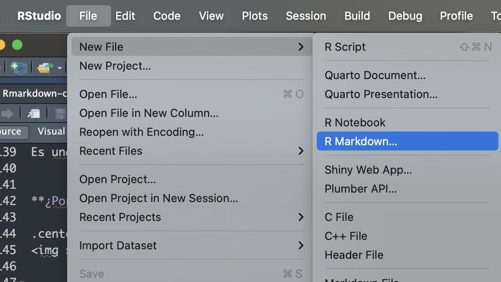
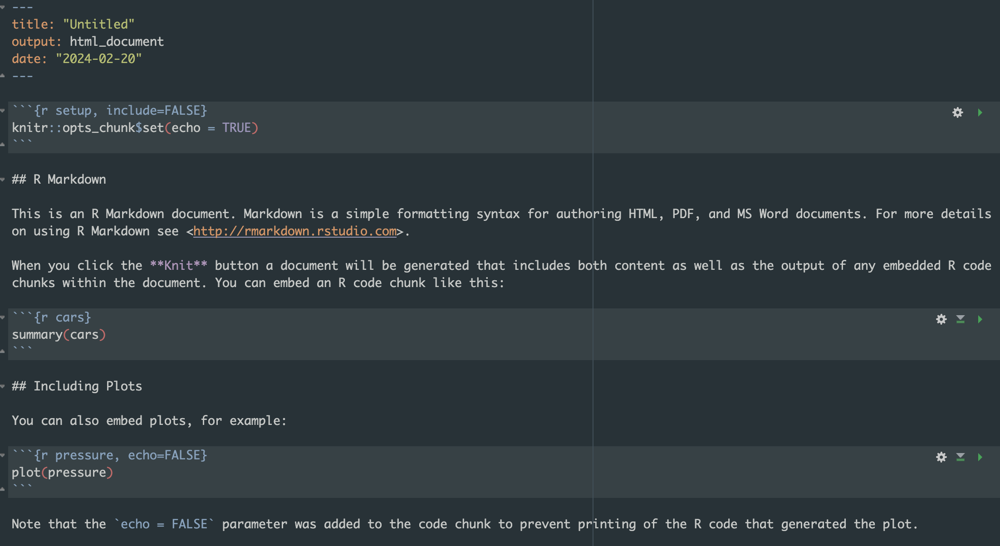
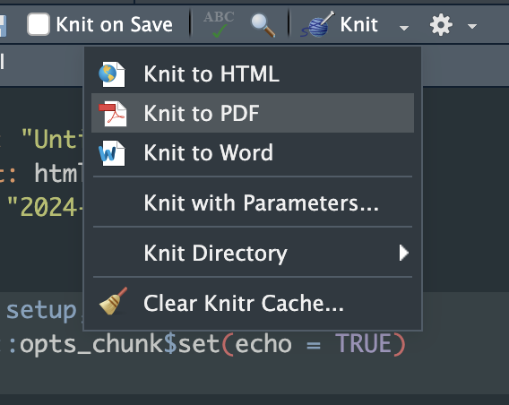
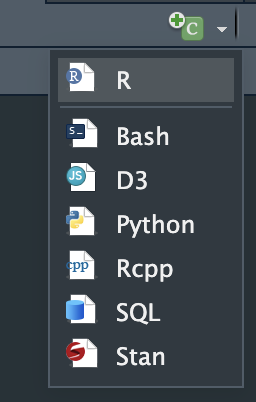

```{r setup, include = FALSE}
# Setup chunk
# Paquetes a usar
#options(htmltools.dir.version = FALSE) cambia la forma de incluir código, los colores

library(knitr)
library(tidyverse)
library(xaringanExtra)
library(icons)
library(fontawesome)
library(emo)

# set default options
opts_chunk$set(collapse = TRUE,
               dpi = 300,
               warning = FALSE,
               error = FALSE,
               comment = "#")

top_icon = function(x) {
  icons::icon_style(
    icons::fontawesome(x),
    position = "fixed", top = 10, right = 10
  )
}

knit_engines$set("yaml", "markdown")

# Con la tecla "O" permite ver todas las diapositivas
xaringanExtra::use_tile_view()
# Agrega el boton de copiar los códigos de los chunks
xaringanExtra::use_clipboard()

# Crea paneles impresionantes 
xaringanExtra::use_panelset()

# Para compartir e incrustar en otro sitio web
xaringanExtra::use_share_again()
xaringanExtra::style_share_again(
  share_buttons = c("twitter", "linkedin")
)

# Funcionalidades de los chunks, pone un triangulito junto a la línea que se señala
xaringanExtra::use_extra_styles(
  hover_code_line = TRUE,         #<<
  mute_unhighlighted_code = TRUE  #<<
)

# Agregar web cam

xaringanExtra::use_webcam()
```

```{r xaringan-editable, echo=FALSE}
# Para tener opciones para hacer editable algun chunk
xaringanExtra::use_editable(expires = 1)
# Para hacer que aparezca el lápiz y goma
xaringanExtra::use_scribble()
```

```{r xaringan-themer, include=FALSE, warning=FALSE}
# Establecer colores para el tema
library(xaringanthemer)
style_mono_light(base_color = "#562457")
```


class: title-slide, middle, center
background-image: url(logo-unam.png)
background-position: 10% 45%
background-size: 25%


.center-column[
# `r rmarkdown::metadata$title`
### `r rmarkdown::metadata$subtitle`

####`r rmarkdown::metadata$author` 
#### `r rmarkdown::metadata$date`
]

---
## .center[Sobre mí]
.left-col[ 
### `r fontawesome::fa("dna", fill = "#181818")` Alejandra Schafer

Estudiante del [Programa de Doctorado en Ciencias Biomedicas](https://www.pdcb.unam.mx/)

Estudiante de doctorado en [RegGenoLab](https://liigh.unam.mx/amedina/)

Licenciada en [Ciencias genomicas](https://www.lcg.unam.mx/), Cuernavaca
]

.center-col[
### `r fontawesome::fa("star", fill = "#181818")` Miembro

- [Proyecto JAGUAR](https://jaguar.liigh.unam.mx/)
]

---
class: center, middle

`r fontawesome::fa("laptop-file", height = "3em")`
# Dia 4. Rmarkdown

---

## ¿Que es y para que sirve Rmarkdown?

Es una herramienta que permite escribir documentos dinamicos con código de R, de manera fácil y legible. 


**¿Por qué realizar un Rmarkdown?**

.center[
]

---
.center[
## ¿Cómo creamos un archivo Rmarkdown?

Vayamos a la parte superior al menú **Archivos > Nuevo documento**.


]
---
.center[

### Lo primero que vamos a tener será un archivo vacio así: 



]
---
.center[

### Y para poder generar los documentos hay que knitearlo así:  

]    

**Los archivos que se pueden generar son:**
* PDF (Tesis o curriculum vitae)
* html (página web o presentaciones)
* Word

---
## Organización de la información: 

** División de titulos:**
```{r}
# Titulo principal
## Subtitulo 1
### Subtitulo 2
#### Subtitulo 3
##### Subtitulo 4
```

# Titulo principal
## Subtitulo 1
### Subtitulo 2
#### Subtitulo 3
##### Subtitulo 4

---

## Organización de la información: 

** Estilos de las letras:** para modificar el estilo hay que agregar un '*' antes y despúes del texto.

```{}
*italica*
**negritas**
***ambos***
~~tachado~~
<span style="color:blue">Texto azul</span> 
```

*italica*.    
**negritas**.     
***ambos***.     
~~tachado~~.   
<span style="color:blue">Texto azul</span> 
---

## Organización de la información: 

** Listas:**

```{}
* uno
* dos
  - 2a
#    - 2b
# * tres
#    - 3a
#        + 3rd layer
#    - 2b
# * cuatro
```

* uno
* dos
    - 2a
    - 2b
* tres
    - 3a
        + 3rd layer
    - 2b
* cuatro

---

## Diferentes lenguajes de programación

### Existen varios lenguajes de programación que se pueden usar en un Rmarkdown

.center[
]

---
## Diferentes lenguajes de programación

### R
```{r}
x = 'hello, world!'
x
```

### Bash
```{bash}
x=$(echo 'hello, world!')
echo $x
```

---

## Visualización de datos

Vamos a usar un set de data predeterminado de R, este se llama pressure. Y vamos a visualizar los datos con la función head()

```{r}
head(pressure)
```

Para ver las estadisticas de estos datos usamos la función summary()

```{r}
summary(pressure)
```

---

## Visualización de datos

Ahora haremos un plot con los datos. 

```{r, out.width="40%"}
plot(pressure, type="l", main="Grafica muestra", xlab="Eje X", ylab="Eje Y")
```

---

class: center, middle

`r fontawesome::fa("circle-question", height = "6em")`
# ¿Dudas?

---

## Ejercicio: 

1. Crea un Rmarkdown 

2. Carga el siguente set de datos

```{r}
datos <- read.csv("https://raw.githubusercontent.com/rpizarrog/Curso-Titulacion-Data-Science-/master/2020/datos/starwars.csv", encoding = "UTF-8")
```

* Visualiza los datos usando la funcion (head) 

* Crea Titulos y subtitulos en el archivo usando la tematica del dataset. 

---

## Generacion de tablas

La forma más sencilla es de la siguiente manera: 

```{}
Cabecera A | Cabecera B
-- | --
Campo A1 | Campo B1
Campo A2 | Campo B2
```

Cabecera A | Cabecera B
-- | --
Campo A1 | Campo B1
Campo A2 | Campo B2

---
## Generacion de tablas

Si queremos modificar la alineación de las columnas. Se pueden poner dos puntos para especificar el orden. 


```{}
| Objetos a la izquierda    | Obetos centrados   | Objetos a la derecha   |
| :------- | :------: | -------: |
| 1   | a  | i   |
| 2   | b  | ii  |
```

| Objetos a la izquierda    | Obetos centrados   | Objetos a la derecha   |
| :------- | :------: | -------: |
| 1   | a  | i   |
| 2   | b  | ii  |

---
## Generacion de tablas


Tambien podemos generar tablas en formato de html 

<table class="table table-hover">
  <thead>
    <tr>
      <th scope="col"><center>Num</center></th>
      <th scope="col"><center>Header</center></th>
      <th scope="col"><center>Header2</center></th>
      <th scope="col"><center>Header3</center></th>
    </tr>
  </thead>
  <tbody>
  </tr>
    <tr class="table-light">
      <th scope="row">1</th>
      <td><center>first</center></td>
      <td><center>1st</center></td>
      <td><center>One</center></td>
  </tr>
   </tr>
    <tr class="table-light">
      <th scope="row">2</th>
      <td><center>second</center></td>
      <td><center>2nd</center></td>
      <td><center>Two</center></td>
  </tr>
  </tr>
    <tr class="table-light">
      <th scope="row">3</th>
      <td><center>third</center></td>
      <td><center>3rd</center></td>
      <td><center>Three</center></td>
  </tr>
  </tbody>
</table>

---
## Generacion de tablas

```{r}
iris %>%
  head(3) %>%
  DT::datatable()
```

---

class: center, middle

`r fontawesome::fa("circle-question", height = "6em")`
# ¿Dudas?

---
## Ejercicio: 

Has una tabla con la siguiente informacion:

```{r}
head(datos[,1:5])
```

---

#Respuesta del ejericicio 

```{}
X | name | height | mass | hair_color
-- | -- | -- | -- | -- 
1	| Luke Skywalker | 172 | 77 | blond
2	| C-3PO | 167 | 75 | NA
3 |	R2-D2 |	96 |	32 |	NA
4	| Darth Vader |	202 |	136 |	none
5 |	Leia Organa |	150 |	49 |	brown
6 |	Owen Lars |	178 |	120 |	brown, grey
```

X | name | height | mass | hair_color
-- | -- | -- | -- | -- 
1	| Luke Skywalker | 172 | 77 | blond
2	| C-3PO | 167 | 75 | NA
3 |	R2-D2 |	96 |	32 |	NA
4	| Darth Vader |	202 |	136 |	none
5 |	Leia Organa |	150 |	49 |	brown
6 |	Owen Lars |	178 |	120 |	brown, grey

---

## Agregar imagenes en un reporte
### Desde internet
```{}
 
```
.center[
]
---

# Agregar imagenes en un reporte

### Desde un archivo de nuestra computadora
```{}

```

.center[
]

---

# Realizar calculos en un texto

Podemos realizar calculos matematicos en el texto usando comillas invertidas (` `) en ambos extremos. 

```{}
La suma de 4 mas 5 es 'r 4+5'
La division de 4 entre 5 es 'r 4/5'
La multiplicacion de 4 por 5 es 'r 4*5'
Si 4^5 cuanto es? 'r 4^5'
Redondear valores, 9.44 se redondea a 'r round(9.44,1)'
```

La suma de 4 mas 5 es `r 4+5`.

La division de 4 entre 5 es `r 4/5`.

La multiplicacion de 4 por 5 es `r 4*5`.

Si 4^5 cuanto es? `r 4^5`.     

Redondear valores, 9.44 se redondea a `r round(9.44,1)`.    

---

## Agregar una ecuacion matematica

```{}
En la misma linea: $A = \pi*r^{2}$ 

Aparte: 

$$y = \mu + \sum_{i=1}^p \beta_i x_i + \epsilon$$

Agregar subindices para formulas CO~2~, alternativamente con `html` CO<sub>2</sub>

Agregar super indice E=MC^2^ o $E=MC^2$, alternativamente con `html` E=MC<sup>2</sup>

```

* En la misma linea: $A = \pi*r^{2}$ 

* Aparte:      

$$y = \mu + \sum_{i=1}^p \beta_i x_i + \epsilon$$
* Agregar subindices para formulas CO~2~, alternativamente con `html` CO<sub>2</sub>

* Agregar super indice E=MC^2^ o $E=MC^2$, alternativamente con `html` E=MC<sup>2</sup>

---

## Agregar un indice en el reporte 

 * Informacion incial
 
```{}
title: "Introduccion a Rmarkdown"
author: "Alejandra Schafer"
date: "2024-02-23"
output: html_document
```
 
* Informacion modificada para agregar el indice

```{}
title: "Introduccion a Rmarkdown"
author: "Alejandra Schafer"
date: "2024-02-23"
output: 
  - html_document:
  - toc: yes
  - toc_float: yes
  - toc_depth: 6
  - theme: cerulean 
```

---

## Agregar un indice en el reporte 

```{}
title: "Introduccion a Rmarkdown"
author: "Alejandra Schafer"
date: "2024-02-23"
output: 
  - html_document:
  - toc: yes
  - toc_float: yes
  - toc_depth: 6
  - theme: cerulean 
```

* **toc** es para indicar que vas a agregar un indice en el reporte. 
* **toc_float** es para indicar si el indice va a ser flotante o no, si indicas `yes` el indice se localizara a la izquiera de la pantalla y la informacion se desplegara cuando se coloques sobre ella. 
* **toc_depth** es para indicar el numero de subtitulos que puedes tener en el archivo.
* **theme** es la decoracion del archivo.      

Para mas temas puedes entrar al siguiente link: https://www.datadreaming.org/post/r-markdown-theme-gallery/

---

## Configuracion de los chunks 

En los chunks algunas cosas que se pueden especificar son: {r setup1, include = FALSE, echo= FALSE, eval=FALSE}:

* **include** = FALSE: no muestra el código.
* **echo** = FALSE: no muestra el resultado en el documento final.
* **warning** = FALSE: no muestra los warnings.
* **error** = FALSE: no muestra los mensajes de error.
* **message** = FALSE: no muestra los mensajes.
* **collapse** = TRUE: de ser posible colapsa la fuente y outputs de los bloques de código.
* **eval** = FALSE: no evalúa los códigos, sirve para mostrar bloques de código sin que emita resultados.
* **fig.dim** = c(n,m): vector numérico para el tamaño de los plots.
* **fig.cap** = "message": para colocar un caption a los plots.

Pueden encontrar mas opciones para los chunks en el siguiente link: https://yihui.org/knitr/options/#chunk-options 

---
class: center, middle

`r fontawesome::fa("circle-question", height = "6em")`
# ¿Dudas?

---

# Ejercicio

1. Agrega una imagen de internet en el archivo de Rmarkdown que creaste previamente. 
2. Suma la la columna de "height" de la tabla que generaste. 
3. Agrega un indice en el documento. 


