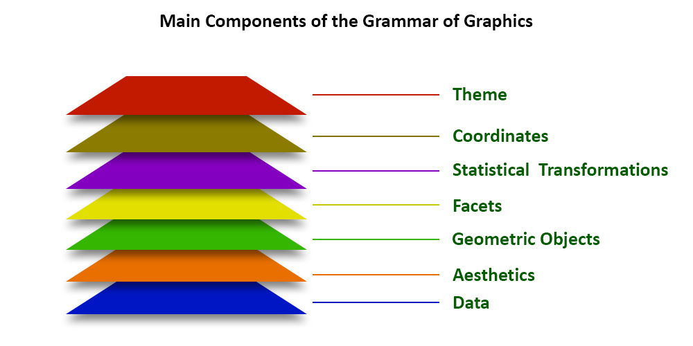
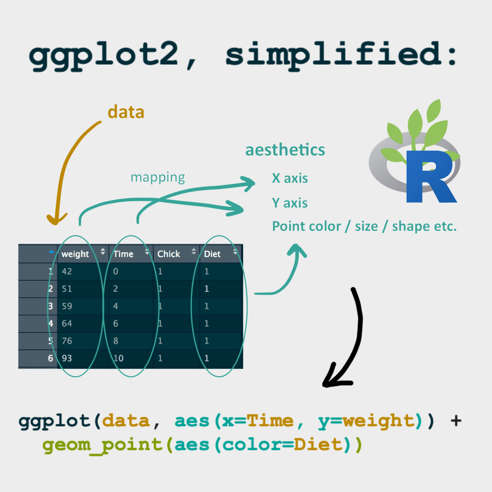

```{r setup, include = FALSE}
# Setup chunk
# Paquetes a usar
#options(htmltools.dir.version = FALSE) cambia la forma de incluir código, los colores

library(knitr)
library(tidyverse)
library(xaringanExtra)
library(icons)
library(fontawesome)
library(emo)

# set default options
opts_chunk$set(collapse = TRUE,
               dpi = 300,
               warning = FALSE,
               error = FALSE,
               comment = "#")

top_icon = function(x) {
  icons::icon_style(
    icons::fontawesome(x),
    position = "fixed", top = 10, right = 10
  )
}

knit_engines$set("yaml", "markdown")

# Con la tecla "O" permite ver todas las diapositivas
xaringanExtra::use_tile_view()
# Agrega el boton de copiar los códigos de los chunks
xaringanExtra::use_clipboard()

# Crea paneles impresionantes 
xaringanExtra::use_panelset()

# Para compartir e incrustar en otro sitio web
xaringanExtra::use_share_again()
xaringanExtra::style_share_again(
  share_buttons = c("twitter", "linkedin")
)

# Funcionalidades de los chunks, pone un triangulito junto a la línea que se señala
xaringanExtra::use_extra_styles(
  hover_code_line = TRUE,         #<<
  mute_unhighlighted_code = TRUE  #<<
)

# Agregar web cam

xaringanExtra::use_webcam()
```

```{r xaringan-editable, echo=FALSE}
# Para tener opciones para hacer editable algun chunk
xaringanExtra::use_editable(expires = 1)
# Para hacer que aparezca el lápiz y goma
xaringanExtra::use_scribble()
```

```{r xaringan-themer, include=FALSE, warning=FALSE}
# Establecer colores para el tema
library(xaringanthemer)
#style_mono_light(base_color = "#562457")
```

class: title-slide, middle, center
background-image: url(imagenes/liigh_unam_logo.png) 
background-position: 10% 10%
background-size: 15% 


.center-column[
# `r rmarkdown::metadata$title`
### `r rmarkdown::metadata$subtitle`

####`r rmarkdown::metadata$author` 
#### `r rmarkdown::metadata$date`
]

---
background-image: url(imagenes/liigh_unam_logo.png) 
background-position: 10% 10%
background-size: 10%
class: middle, center


# VieRnes de Bioinformática
----

.left-col[ 
### `r fontawesome::fa("dna", fill = "#181818")` Sofía Salazar Magaña

Estudiante de la [Licenciatura en Ciencias Genómicas](https://www.enesjuriquilla.unam.mx/?page_id=2136) @ ENES-J UNAM

Asistente de investigación @ [RegGenoLab](https://liigh.unam.mx/), LIIGH UNAM

Asistente de investigación @ [Im Lab](https://hakyimlab.org/), The University of Chicago 


[`r fontawesome::fa("github")` GitHub: SophSM](https://github.com/SophSM)
]

.center-col[
### `r fontawesome::fa("star", fill = "#181818")` Miembro

- [LupusRGMX](https://twitter.com/LupusRgmx)

- [Proyecto JAGUAR](https://twitter.com/PJaguarLATAM)
]

.right-col[


]
---
class: center, middle

`r fontawesome::fa("code", height = "3em")`
# Clase 8. Generación de diversos gráficos usando ggplot2

---

# Qué es ggplot2?

- Una biblioteca de visualización de datos para el lenguaje de programación R.

- Permite a los usuarios construir gráficos complejos a partir de componentes simples y entendibles.

- Ofrece amplias opciones para personalizar gráficos, incluyendo temas, leyendas y títulos.
---
# [Anatomía de las gráficas de ggplot](https://www.geeksforgeeks.org/data-visualization-with-r-and-ggplot2/)



---
# [Anatomía de las gráficas de ggplot](https://www.geeksforgeeks.org/data-visualization-with-r-and-ggplot2/)

- **Datos**: ggplot2 trabaja directamente con data frames en R, haciendo fácil la integración con otras herramientas de análisis de datos.

- **Aes (Estéticas)**: Define cómo se mapean las variables de los datos a propiedades visuales como el color, forma y tamaño.

- **Geoms (Objetos Geométricos)**: Representan tipos de gráficos como puntos, líneas, barras, etc. Permiten construir una amplia gama de visualizaciones.

- **Facets**: permiten generar gráficos para múltiples subconjuntos de un conjunto de datos utilizando la misma escala y ejes, todo en una sola imagen

- **Stats**: son funciones que resumen o transforman los datos de formas que facilitan su visualización
---

# De un dataframe a una gráfica



.right-col[Source: [R for ecology](https://www.rforecology.com/post/a-simple-introduction-to-ggplot2/)]

---

# Ideas de visualizaciones

### - [The data visualization catalogue](https://datavizcatalogue.com/#google_vignette)

### - [The R graph gallery](https://r-graph-gallery.com/)

---

# Script para la clase de hoy

Ir a [este link](https://github.com/EveliaCoss/ViernesBioinfo2024/tree/main/Clase_ggplot/script_ggplot_clase.R)